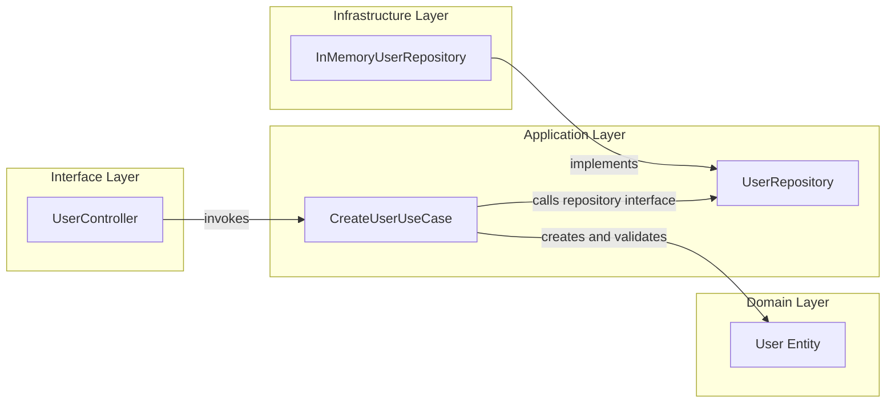
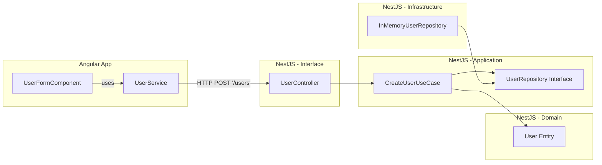

# ¿Que es Construcción de Software?

**Construcción de Software** es la disciplina que se enfoca en la transformación de diseños y requisitos en código ejecutable, aplicando principios, metodologías, herramientas y buenas prácticas para garantizar que el producto resultante sea funcional, mantenible, extensible y de alta calidad.

## ¿Por qué es importante?

*Construcción no es solo codificación*: implica decisiones estratégicas sobre estructura, calidad, pruebas, documentación, estilo de codificación, uso adecuado de frameworks, control de versiones, automatización de tareas y aplicación de patrones de diseño. **Es el puente entre la arquitectura del sistema y el software operativo**.

## Actividades principales de la construcción de software

- **Codificación**: traducción de diseño en código funcional.
- **Pruebas unitarias**: validación del comportamiento esperado de componentes.
- **Depuración**: análisis y corrección de errores.
- **Integración**: unión de módulos para asegurar funcionamiento conjunto.
- **Gestión de configuración**: control de versions, cambios y dependencias.
- **Automatización**: CI/CD, linters, pruebas automatizadas, etc.

## Fundamentos de una buena construcción

- **Claridad** y **legibilidad** del código.
- Estructura modular y coherente.
- Adherencia a principios **SOLID** y **patrones** de arquitectura.
- **Documentación** significativa y actualizada.
- Manejo adecuado de errores y excepciones.
- Alineación entre código y requisitos funcionales.

## Ejemplo de Clean Architecture

El siguiente ejemplo muestra una aplicación básica construida con **Clean Architecture**: entidades, casos de uso, infraestructura y capa de presentación; todo debidamente separado.



import Tabs from "@theme/Tabs";
import TabItem from "@theme/TabItem";

<Tabs>
<TabItem value="ts1" label="Entidad">

```ts title="File: src/user/domain/entities/user.entity.ts" showLineNumbers
/**
 * Represents a User in the system.
 */
export class User {
  constructor(
    public readonly id: string,
    public name: string,
    public email: string
  ) {
    if (!email.includes('@')) throw new Error('Invalid email');
  }
}
```

</TabItem>
<TabItem value="ts2" label="Caso de uso">

```ts title="File: src/user/application/use-cases/create-user.use-case.ts" showLineNumbers
import { UserRepository } from '../repositories/user.repository';
import { User } from '../../domain/entities/user.entity';

export class CreateUserUseCase {
  constructor(private readonly userRepo: UserRepository) {}

  async execute(name: string, email: string): Promise<User> {
    const user = new User(crypto.randomUUID(), name, email);
    return this.userRepo.save(user);
  }
}
```

</TabItem>
<TabItem value="ts3" label="Repositorio">

```ts title="File: src/user/infrastructure/repositories/in-memory-user.repository.ts" showLineNumbers
import { UserRepository } from '../../application/repositories/user.repository';
import { User } from '../../domain/entities/user.entity';

export class InMemoryUserRepository implements UserRepository {
  private users: User[] = [];

  async save(user: User): Promise<User> {
    this.users.push(user);
    return user;
  }
}
```

</TabItem>
<TabItem value="ts4" label="Controlador">

```ts title="File: src/user/interfaces/controllers/user.controller.ts" showLineNumbers
import { Controller, Post, Body } from '@nestjs/common';
import { CreateUserUseCase } from '../../application/use-cases/create-user.use-case';

@Controller('users')
export class UserController {
  constructor(private readonly createUser: CreateUserUseCase) {}

  @Post()
  async create(@Body() data: { name: string; email: string }) {
    return this.createUser.execute(data.name, data.email);
  }
}
```

</TabItem>
</Tabs>

Ahora veamos en diagrama como un cliente (Angular), interactúa con el backend (NestJS) a través de servicios HTTP, manteniendo principios de Clean Architecture y separación de responsabilidades:



## Aplicaciones prácticas

|Contexto|Aplicación de la construcción de software|
|--|--|
|**Proyectos ágiles**|Traducción continua de historias de usuario a código testeado.|
|**Startups**|Rapidez con calidad y mantenimiento para escalar.|
|**Empresas**|Garantiza coherencia y estabilidad en grandes equipos de desarrollo.|
|**Sistemas críticos** |Reduce errores humanos, facilita la trazabilidad y la validación.|

## Es momento de que te preguntes

- **Ejercicio 1:** ¿Qué no es construcción de software?
  
  *Nivel:* Individual

  *Enunciado:* Redacta una lista de actividades comunes en el desarrollo de software que no hacen parte directa de la construcción, pero que la complementan. Justifica tu clasificación.

  *Objetivo:* Identificar límites y conexiones con otras etapas.

- **Ejercicio 2:** Refactorización orientada a SOLID

  *Nivel:* Grupal (2-3 personas)

  *Enunciado:* Se te entrega una clase UserManager monolítica con múltiples responsabilidades. Ajustala usando principios SOLID, separando entidades, casos de uso y repositorios.

  *Objetivo:* Aplicar Clean Code y Clean Architecture.

- **Ejercicio 3:** Diagrama de capas

  *Nivel:* Individual

  *Enunciado:* Dibuja un diagrama de Clean Architecture para un sistema de gestión de tareas con Angular (frontend) y NestJS (backend).

  *Objetivo:* Comprender separación de capas y responsabilidades.

- **Ejercicio 4:** Análisis de errores frecuentes

  *Nivel:* Grupal (3-4 personas)

  *Enunciado:* Revisa fragmentos de código con errores de construcción (nombres confusos, responsabilidades mezcladas, mal manejo de errores) y propón mejoras.

  *Objetivo:* Identificar malas prácticas y reforzar criterios de calidad.

- **Ejercicio 5:** Construcción dirigida por pruebas

  *Nivel:* Individual

  *Enunciado:* Implementa una función calculateTotalPrice(cart: Product[]) que sume el total, aplicando TDD y respetando los principios SOLID.

  *Objetivo:* Introducir buenas prácticas de diseño y pruebas desde el inicio.

## Resumen de Buenas Prácticas aplicadas

|Principio|Aplicación en el ejemplo|
|--|--|
|**Clean Code**|Código legible, nombres descriptivos, funciones simples.|
|**SOLID**|Separación de responsabilidades, inyección de dependencias, interfaces claras.|
|**Clean Architecture**|Capas bien definidas: dominio, aplicación, infraestructura, interfaces.|
|**Documentación**|Comentarios útiles en entidades, claridad en controladores.|
|**Testing**|Fomenta pruebas desde el diseño con TDD.|

## Referencias

- McConnell, S. (2004). [Code Complete (2nd ed.)](https://www.microsoftpressstore.com/store/code-complete-9780735619678). Microsoft Press.
- Martin, R. C. (2009). [Clean Code: A Handbook of Agile Software Craftsmanship. Prentice Hall.](https://www.oreilly.com/library/view/clean-code/9780136083238/)
- Martin, R. C. (2017). [Clean Architecture: A Craftsman's Guide to Software Structure and Design](https://www.oreilly.com/library/view/clean-architecture-a/9780134494272/). Prentice Hall.
- Sommerville, I. (2016). [Software Engineering (10th ed.)](https://www.pearson.com/store/p/software-engineering/P100000603232). Pearson.
- [NestJS Official Documentation](https://docs.nestjs.com)
