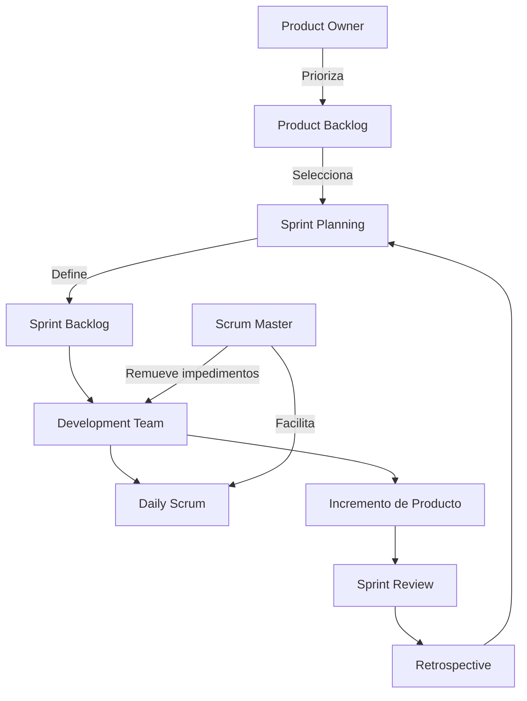

# Introducción al enfoque ágil y al modelo SCRUM

## ¿Qué es el enfoque ágil?

El **enfoque ágil** es una filosofía para la construcción de software que promueve la **entrega temprana** y **continua de valor**, la **colaboración constante con el cliente**, y la **capacidad de adaptación** a cambios imprevistos. Surge como respuesta a metodologías rígidas como el modelo en cascada, donde los cambios eran costosos y la entrega final podía tardar meses o años.

Este enfoque se formalizó con el **Manifiesto Ágil (2001)**, que establece:

> "Valoramos más..."
>
> - "*Individuos e interacciones* sobre procesos y herramientas"
> - "*Software funcionando* sobre documentación exhaustiva"
> - "*Colaboración con el cliente* sobre negociación contractual"
> - "*Respuesta al cambio* sobre seguir un plan"

Aunque se valora todo lo mencionado, la prioridad recae en lo primero de cada línea.

## ¿Qué es SCRUM?

**SCRUM** es un marco de trabajo ágil iterativo e incremental que organiza el trabajo en ciclos fijos llamados **Sprints** (usualmente de 2 a 4 semanas). Es ligero, flexible y adaptable, con énfasis en la inspección, adaptación y transparencia.

### Roles en SCRUM

- **Product Owner**: Define el producto, prioriza el *Product Backlog*, maximiza valor.
- **Scrum Master**: Facilita SCRUM, elimina impedimentos, protege al equipo.
- **Development Team**: Equipo multifuncional que entrega valor en cada Sprint.

### Eventos clave

|Evento|Propósito|
|--|--|
|**Sprint Planning**|Planificar qué se hará en el Sprint|
|**Daily Scrum**|Sincronizar progreso y detectar bloqueos (15 min)|
|**Sprint Review**|Mostrar lo construido y recibir retroalimentación|
|**Sprint Retrospective**|Mejorar continuamente la forma de trabajo|

## Representemos en código el Backlog

Este ejemplo implementa una interfaz sencilla para **gestionar historias de usuario** en **Angular**, simulando un *Product Backlog* para SCRUM.

import Tabs from "@theme/Tabs";
import TabItem from "@theme/TabItem";

<Tabs>
<TabItem value="ts1" label="Modelo">

```ts title="src/app/models/user-story.model.ts" showLineNumbers
export interface UserStory {
  id: string;
  title: string;
  description: string;
  priority: 'High' | 'Medium' | 'Low';
  status: 'To Do' | 'In Progress' | 'Done';
}
```

</TabItem>
<TabItem value="ts2" label="Servicio">

```ts title="src/app/services/backlog.service.ts" showLineNumbers
import { Injectable } from '@angular/core';
import { UserStory } from '../models/user-story.model';
import { v4 as uuid } from 'uuid';

@Injectable({ providedIn: 'root' })
export class BacklogService {
  private stories: UserStory[] = [];

  getAll(): UserStory[] {
    return this.stories;
  }

  addStory(title: string, description: string, priority: 'High' | 'Medium' | 'Low'): UserStory {
    const newStory: UserStory = {
      id: uuid(),
      title,
      description,
      priority,
      status: 'To Do',
    };
    this.stories.push(newStory);
    return newStory;
  }

  updateStatus(id: string, status: 'To Do' | 'In Progress' | 'Done') {
    const story = this.stories.find(s => s.id === id);
    if (story) story.status = status;
  }
}
```

</TabItem>
<TabItem value="ts3" label="Componente básico">

```ts title="src/app/components/backlog/backlog.component.ts" showLineNumbers
import { Component } from '@angular/core';
import { BacklogService } from '../../services/backlog.service';
import { UserStory } from '../../models/user-story.model';

@Component({
  selector: 'app-backlog',
  templateUrl: './backlog.component.html'
})
export class BacklogComponent {
  stories: UserStory[] = [];

  constructor(private backlogService: BacklogService) {
    this.stories = this.backlogService.getAll();
  }
}
```

</TabItem>
</Tabs>

## Aplicaciones prácticas

|Contexto|Aplicación de SCRUM|
|--|--|
|**Startups**|Rápida entrega y adaptación al mercado.|
|**Equipos educativos**|Desarrollos iterativos en semestres.|
|**Proyectos académicos**|Gestión ágil de equipos estudiantiles.|
|**Empresas de software**|Incrementos predecibles, visibilidad.|

## Flujo de trabajo SCRUM



## Aplicación en Buenas Prácticas

|Principio|Aplicación en el enfoque SCRUM|
|--|--|
|**Clean Code**|Historias claras, código simple, legible por todo el equipo.|
|**SOLID**|Servicios bien definidos, responsabilidades únicas.|
|**Clean Architecture**|Separación entre UI, lógica de negocio y servicios.|
|**Transparencia y adaptabilidad**|SCRUM fomenta iteraciones visibles y adaptables.|

## Referencias

- Beck, K., Beedle, M., van Bennekum, A., et al. (2001). [Manifesto for Agile Software Development.](https://agilemanifesto.org/)
- Schwaber, K., & Sutherland, J. (2020). [The Scrum Guide.](https://scrumguides.org)
- Rubin, K. S. (2012). [Essential Scrum: A Practical Guide to the Most Popular Agile Process](https://www.informit.com/store/essential-scrum-a-practical-guide-to-the-most-popular-9780137043293). Addison-Wesley.
- Cohn, M. (2004). [User Stories Applied: For Agile Software Development](https://www.informit.com/store/user-stories-applied-for-agile-software-development-9780321205681). Addison-Wesley.
- [Angular Docs](https://angular.io/docs)
