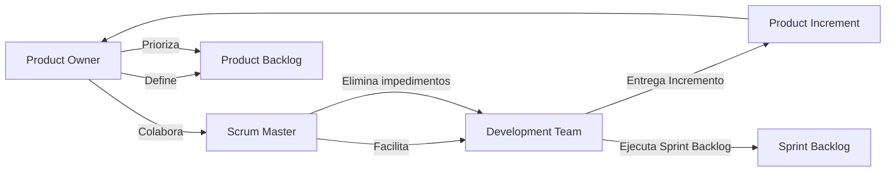

# Roles de un equipo SCRUM

SCRUM define tres roles fundamentales que conforman el **SCRUM Team**. Cada uno tiene responsabilidades específicas pero colaboran constantemente para lograr el objetivo común: **entregar valor al cliente en cada Sprint**.

## Product Owner (PO)

El **Product Owner** representa los intereses del cliente y usuarios. Su objetivo es **maximizar el valor del producto**.

Responsabilidades:

- Gestionar y priorizar el **Product Backlog**.
- Establecer la **visión del producto**.
- Asegurar que el equipo entienda bien lo que se va a construir.
- Estar disponible para aclarar requisitos.
- Validar los entregables junto al cliente.

Perfil ideal:

- Capacidad de toma de decisiones.
- Alta comunicación.
- Enlace constante entre negocio y equipo técnico.

## Scrum Master (SM)

El **Scrum Master** es un **facilitador** y **mentor del equipo**. No dirige, sino que **ayuda a que el equipo siga los principios de SCRUM** y eliminen impedimentos.

Responsabilidades:

- Garantizar que se sigan los eventos y artefactos de SCRUM.
- Remover obstáculos que afecten al equipo.
- Promover la mejora continua (Kaizen).
- Mediar conflictos o tensiones.
- Formar a nuevos miembros en SCRUM.

Perfil ideal:

- Buenas habilidades blandas.
- Liderazgo servicial.
- Conocimiento profundo de SCRUM.

## Development Team (DT)

El **Development Team** es responsable de **construir el producto**. Se trata de un grupo **autónomo**, **multifuncional** y **autoorganizado**.

Características:

- Entre 3 y 9 personas (idealmente).
- Roles técnicos diversos: frontend, backend, QA, diseño UX.
- Nadie fuera del equipo dicta cómo trabajar.
- Entregan **incrementos funcionales** al final de cada Sprint.

Responsabilidades:

- Estimar, planificar y ejecutar tareas del Sprint.
- Escribir código funcional y probado.
- Participar activamente en todas las ceremonias SCRUM.
- Colaborar en mejora continua.

## Aplicaciones prácticas

|Proyecto|Aplicación de roles SCRUM|
|--|--|
|**Software educativo**|PO define funcionalidades clave; equipo implementa MVP.|
|**Hackatones académicas**|Se asignan roles SCRUM en cada equipo para mejorar la organización.|
|**Startups tecnológicas**|Un Scrum Master evita bloqueos mientras el equipo técnico entrega.|

## Buenas prácticas aplicadas

|Práctica|Rol que la promueve|
|--|--|
|**Transparencia y priorización**|Product Owner|
|**Facilitación sin imposición**|Scrum Master|
|**Autonomía técnica y responsabilidad compartida**|Development Team|
|**Retroalimentación continua**|Todos los roles|
|**Documentación ligera pero útil**|Product Owner y Scrum Master|

## Flujo para roles SCRUM

## Referencias

- Schwaber, K., & Sutherland, J. (2020). [The Scrum Guide](https://scrumguides.org/). Scrum.org.
- Rubin, K. S. (2012). [Essential Scrum: A Practical Guide to the Most Popular Agile Process](https://www.informit.com/store/essential-scrum-a-practical-guide-to-the-most-popular-9780137043293). Addison-Wesley.
- Cohn, M. (2004). [User Stories Applied: For Agile Software Development.](https://www.informit.com/store/user-stories-applied-for-agile-software-development-9780321205681) Addison-Wesley.
- Beck, K. et al. (2001). [Manifesto for Agile Software Development.](https://agilemanifesto.org/)
- [Angular Docs](https://angular.io/docs)
