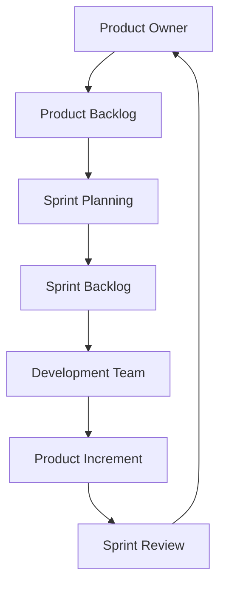

# Artefactos: backlog, sprint, entregables

SCRUM define **tres artefactos esenciales** que permiten planificar, gestionar y entregar valor en ciclos iterativos. Cada artefacto representa **información clave y transparente** sobre el progreso y estado del proyecto.

## Product Backlog

El **Product Backlog** es una lista ordenada y evolucionable de todo lo que se necesita en el producto. Es responsabilidad del **Product Owner** mantenerlo actualizado y priorizado.

Características:

- Es **dinámico**: cambia constantemente.
- Cada ítem es una **Historia de Usuario**, épica o requerimiento.
- Debe ser **refinado** en sesiones de Grooming/Backlog Refinement.

Ejemplo (formato historia de usuario):

> "Como estudiante, quiero registrar mis materias para llevar control de mi semestre."

## Sprint Backlog

Es un subconjunto del Product Backlog seleccionado durante la **Sprint Planning**, que se compromete a desarrollar el equipo SCRUM durante un Sprint.

Incluye:

- Historias seleccionadas (objetivo del Sprint).
- Tareas técnicas necesarias para completarlas.
- Actualizaciones diarias durante los **Daily Scrum**.

## Incremento (Entregable)

El **Incremento** es el conjunto de **funcionalidades terminadas** y **potencialmente entregables** al final de cada Sprint. Debe cumplir con la **Definition of Done (DoD)** del equipo.

Criterios comunes para el DoD:

- Código funcional.
- Pruebas superadas.
- Revisión de código.
- Documentación mínima.
- Deploy listo o automatizado.

## Aplicaciones prácticas

|Artefacto|Aplicación académica o profesional|
|--|--|
|Product Backlog|Planificación del proyecto semestral con usuarios reales|
|Sprint Backlog|Tareas asignadas para la semana de trabajo|
|Incremento|App funcional parcial presentada al final de cada iteración|

## Flujo de acción entre artefactos

## Buenas prácticas aplicadas

|Práctica|Artefacto relacionado|
|--|--|
|Priorización continua|Product Backlog|
|Transparencia y claridad|Sprint Backlog|
|Revisión colaborativa y testing|Incremento|
|Trazabilidad|Todos|
|Iteración corta y entregable|Incremento|

## Referencias

- Schwaber, K., & Sutherland, J. (2020). [The Scrum Guide](https://scrumguides.org/). Scrum.org.
- Rubin, K. S. (2012). [Essential Scrum: A Practical Guide to the Most Popular Agile Process](https://www.informit.com/store/essential-scrum-a-practical-guide-to-the-most-popular-9780137043293). Addison-Wesley.
- Cohn, M. (2004). [User Stories Applied: For Agile Software Development.](https://www.informit.com/store/user-stories-applied-for-agile-software-development-9780321205681) Addison-Wesley.
- Beck, K. et al. (2001). [Manifesto for Agile Software Development.](https://agilemanifesto.org/)
- [Angular Docs](https://angular.io/docs)
