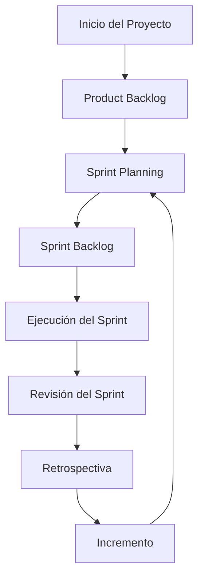

# Ciclo de vida de un proyecto ágil

El **ciclo de vida de un proyecto ágil** representa la evolución de un producto o solución de software **desde su concepción hasta su despliegue y mejora continua**, todo dentro de un marco iterativo e incremental.

A diferencia del modelo en cascada, donde las fases son secuenciales y rígidas, el ciclo ágil favorece la **adaptabilidad**, **entrega frecuente** y **aprendizaje constante**. Cada iteración (Sprint) genera un **incremento funcional** que puede ser evaluado, validado y mejorado en el siguiente ciclo.

## Fases principales del ciclo de vida ágil

|Fase|Descripción|
|--|--|
|**1. Inicio del proyecto**|Identificación del problema, definición de objetivos y visión del producto. Se forman los roles del equipo SCRUM.|
|**2. Construcción del backlog**|Se definen las historias de usuario y se priorizan en el Product Backlog.|
|**3. Planificación del Sprint**|El equipo selecciona historias y tareas viables para el Sprint. Se define el Sprint Goal.|
|**4. Ejecución del Sprint**|El equipo desarrolla el producto. Se realizan reuniones diarias (*Daily Scrum*).|
|**5. Revisión del Sprint**|Se presenta el incremento funcional y se recibe retroalimentación.|
|**6. Retrospectiva del Sprint**|Se analizan aspectos a mejorar en el equipo o en el proceso.|
|**7. Siguiente Sprint**|Se inicia una nueva iteración con aprendizajes aplicados.|

Este ciclo **se repite constantemente** hasta lograr un producto completo o alcanzar los objetivos deseados.

## Ejemplo aplicado en Angular/NestJS

Imaginemos un proyecto educativo: “**Plataforma de asistencia y gestión académica**”. A continuación, se muestra cómo este proyecto avanza a lo largo del ciclo ágil.

### Fase 1: Inicio del proyecto

- **Problema**: La universidad carece de una plataforma digital para el control de asistencia.
- **Objetivo**: Implementar un sistema que permita a estudiantes y docentes registrar, consultar y validar asistencia.

### Fase 2: Product Backlog (PO)

1. Como docente, quiero registrar asistencia para mis clases.
2. Como estudiante, quiero consultar mis asistencias.
3. Como administrador, quiero ver reportes por curso.

### Fase 3: Sprint Planning (Scrum Team)

- **Sprint Goal**: Implementar registro de asistencia docente.
- Historias seleccionadas: #1 y #2.
- Tareas:
  - Componente Angular `AttendanceFormComponent`
  - Endpoint NestJS `POST /attendance`
  - Servicio `AttendanceService`

### Fase 4: Ejecución (DT)

```ts title="Angular: attendance-form.component.ts" showLineNumbers
onSubmit() {
  this.attendanceService.record(this.form.value).subscribe(() => {
    alert('Asistencia registrada');
  });
}
```

```ts title="NestJS: attendance.controller.ts" showLineNumbers
@Post()
recordAttendance(@Body() dto: AttendanceDto) {
  return this.attendanceService.record(dto);
}
```

### Fase 5–6: Revisión y Retrospectiva

- El equipo demuestra el módulo.
- El cliente sugiere cambiar el selector de fecha.
- El equipo nota que deben documentar mejor las interfaces.

## Ciclo de vida ágil



## Buenas prácticas aplicadas

|Práctica|Fase del ciclo donde aplica|
|--|--|
|Reuniones cortas y efectivas|Daily Scrum|
|Priorización por valor|Construcción del Backlog|
|Mejora continua|Retrospectiva|
|Entregables funcionales|Incremento del Sprint|
|Feedback temprano|Revisión del Sprint|

## Referencias

- Schwaber, K., & Sutherland, J. (2020). [The Scrum Guide](https://scrumguides.org/). Scrum.org.
- Rubin, K. S. (2012). [Essential Scrum: A Practical Guide to the Most Popular Agile Process](https://www.informit.com/store/essential-scrum-a-practical-guide-to-the-most-popular-9780137043293). Addison-Wesley.
- Cohn, M. (2004). [User Stories Applied: For Agile Software Development.](https://www.informit.com/store/user-stories-applied-for-agile-software-development-9780321205681) Addison-Wesley.
- Beck, K. et al. (2001). [Manifesto for Agile Software Development.](https://agilemanifesto.org/)
- [Angular Docs](https://angular.io/docs)
- [NestJS Docs](https://docs.nestjs.com/)
