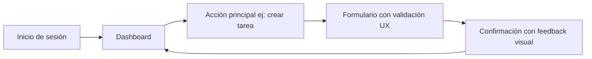

# Principios de UX/UI

Aunque **UX** y **UI** están **profundamente relacionados**, no son lo mismo. UX se enfoca en **cómo se siente y fluye la experiencia**, mientras que UI se centra en cómo **se ve y se comporta visualmente la interfaz.**

- **UX (User Experience)**: es la experiencia completa que un usuario tiene al interactuar con un producto. Abarca usabilidad, accesibilidad, satisfacción, eficiencia, etc.
- **UI (User Interface)**: es el conjunto de elementos visuales, estéticos e interactivos con los que el usuario interactúa: botones, tipografía, colores, diseño visual.

## Principios clave de UX (User Experience)

|Principio UX|Descripción|
|--|--|
|**Usabilidad**|Facilidad para aprender, usar y recordar cómo funciona una app.|
|**Accesibilidad**|Garantizar que personas con discapacidad puedan usar el sistema.|
|**Consistencia**|Patrones similares para acciones similares (botones, menús, flujos).|
|**Feedback inmediato**|El sistema debe reaccionar visual o sonoramente a las acciones del usuario.|
|**Jerarquía visual**|Organización clara de lo importante (colores, tamaños, posiciones).|
|**Carga cognitiva baja**|No sobrecargar al usuario con decisiones o información innecesaria.|

### Flujo UX simplificado



## Principios clave de UI (User Interface)

|Principio UI|Descripción|
|--|--|
|**Claridad visual**|Textos legibles, íconos entendibles, espacios adecuados.|
|**Color con propósito**|Usar colores con función: advertencia, éxito, error, etc.|
|**Tipografía jerárquica**|Diferenciar títulos, subtítulos y cuerpo de texto.|
|**Responsive Design**|Interfaces que se adaptan a cualquier dispositivo.|
|**Consistencia estética**|Íconos, botones, estilos y animaciones coherentes.|

## Ejemplo técnico en Angular

Implementación de un formulario de inicio de sesión accesible, claro y responsive:

```html title="HTML (Angular Template)" showLineNumbers
<form [formGroup]="loginForm" (ngSubmit)="onSubmit()" class="login-form">
  <h2>Iniciar Sesión</h2>

  <label for="email">Correo electrónico</label>
  <input
    id="email"
    formControlName="email"
    type="email"
    aria-describedby="emailHelp"
    required
  />
  <div *ngIf="loginForm.get('email')?.invalid && loginForm.get('email')?.touched">
    <small id="emailHelp">Ingresa un correo válido.</small>
  </div>

  <label for="password">Contraseña</label>
  <input id="password" formControlName="password" type="password" required />

  <button type="submit" [disabled]="loginForm.invalid">Ingresar</button>
</form>
```

```css title="CSS (estilos base con enfoque UI)" showLineNumbers
.login-form {
  max-width: 400px;
  margin: auto;
  padding: 2rem;
  border-radius: 8px;
  background-color: #fff;
  box-shadow: 0 0 10px rgba(0, 0, 0, 0.1);
}

.login-form h2 {
  margin-bottom: 1rem;
  text-align: center;
}

.login-form label {
  display: block;
  margin-top: 1rem;
}

.login-form input {
  width: 100%;
  padding: 0.5rem;
  margin-top: 0.25rem;
  border: 1px solid #ccc;
  border-radius: 4px;
}
```

Principios aplicados:

- Feedback visual en errores.
- Contrastes adecuados.
- Accesibilidad básica (uso de aria-describedby).
- Diseño limpio y centrado.

## Buenas prácticas aplicadas

|Principio aplicado|Impacto en el producto final|
|--|--|
|Feedback inmediato|Reduce frustraciones|
|Consistencia visual|Aumenta la confianza del usuario|
|Accesibilidad|Aumenta la inclusión y usabilidad|
|Responsive design|Asegura uso en dispositivos móviles|
|Jerarquía visual|Facilita navegación y comprensión|

## Referencias

- Nielsen, J. (1994). [Usability Engineering](https://www.nngroup.com/books/usability-engineering/). Morgan Kaufmann.
- Krug, S. (2014). [Don't Make Me Think: A Common Sense Approach to Web Usability](https://www.amazon.com/Dont-Make-Me-Think-Usability/dp/0321965515). New Riders.
- Norman, D. A. (2013). [The Design of Everyday Things](https://www.jnd.org/books/the-design-of-everyday-things-revised-and-expanded-edition.html). Basic Books.
- [Angular Material Guidelines](https://material.angular.io/)
- [W3C Accessibility](https://www.w3.org/WAI/)
