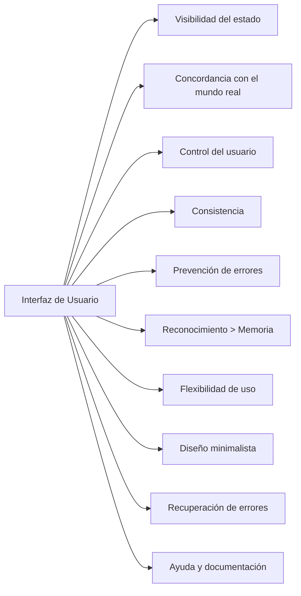

# Heurísticas de usabilidad de Nielsen

Las **heurísticas de usabilidad** son principios generales propuestos por **Jakob Nielsen** que permiten evaluar la calidad de una interfaz en cuanto a su facilidad de uso. Estas **10 reglas empíricas** no son reglas rígidas, sino guías que ayudan a identificar problemas comunes en la interacción humano-computador.

Se usan principalmente en **evaluaciones heurísticas**, donde expertos inspeccionan una interfaz y detectan violaciones a estas heurísticas.

## Las 10 heurísticas de Nielsen

|#|Heurística|Descripción|
|--|--|--|
|1|**Visibilidad del estado del sistema**|Informar al usuario de lo que está ocurriendo (cargas, confirmaciones, errores).|
|2|**Concordancia entre el sistema y el mundo real**|Usar términos y conceptos familiares para el usuario.|
|3|**Control y libertad del usuario**|Permitir deshacer/redo y evitar acciones irreversibles.|
|4|**Consistencia y estándares**|Mantener patrones visuales y de comportamiento comunes.|
|5|**Prevención de errores**|Diseñar para evitar que ocurran errores.|
|6|**Reconocimiento mejor que recuerdo**|Minimizar la necesidad de memorizar pasos o datos.|
|7|**Flexibilidad y eficiencia de uso**|Permitir atajos para usuarios expertos sin afectar a novatos.|
|8|**Estética y diseño minimalista**|No sobrecargar con información irrelevante.|
|9|**Ayudar a los usuarios a reconocer, diagnosticar y recuperarse de errores**|Mensajes claros, con causa y solución.|
|10|**Ayuda y documentación**|Ofrecer ayuda accesible y contextual, aunque no siempre necesaria.|

## Ejemplo aplicado en Angular

Supongamos una app de gestión de tareas. A continuación se muestra cómo aplicar las heurísticas en una pantalla de creación de tareas.

```html
<form [formGroup]="taskForm" (ngSubmit)="createTask()" aria-describedby="taskHint">
  <label for="task">Nueva tarea:</label>
  <input id="task" formControlName="task" placeholder="Escribe tu tarea..." required />

  <small id="taskHint">La descripción debe tener al menos 5 caracteres.</small>

  <button type="submit" [disabled]="taskForm.invalid">Agregar</button>
  <div *ngIf="submitted && taskForm.invalid" class="error">
    La tarea es obligatoria.
  </div>
</form>
```

Las heurísticas aplicadas al ejemplo fueron:

|Heurística |Aplicación en el código|
|--|--|
|1|Feedback visual con validación e indicador de error.|
|2|Lenguaje cotidiano (“Nueva tarea”, no “Input de descripción”).|
|5|Prevención: validación de campos antes de enviar.|
|6|Texto guía visible (placeholder y `aria-describedby`).|

## Aplicaciones prácticas

|Sector|Uso de heurísticas Nielsen|
|--|--|
|Educación|Portales LMS accesibles y amigables para estudiantes.|
|Banca|Interfaces intuitivas que previenen errores en transacciones.|
|Gobierno|Formularios en línea con lenguaje claro y validaciones visibles.|
|Comercio|Flujos de compra optimizados y coherentes.|

## Relación entre buenas prácticas y heurísticas

|Práctica|Relación con heurísticas Nielsen|
|--|--|
|Validaciones claras y accesibles|1, 5, 9|
|Uso de lenguaje cotidiano y simple|2|
|Diseño consistente y reutilizable|4, 8|
|Uso de tooltips, placeholders, guías|6, 10|
|Flexibilidad de interacción (teclado, ratón, accesos)|3, 7|

## Evaluación heurística



## Referencias

- Nielsen, J. (1994). [Usability Engineering](https://www.nngroup.com/books/usability-engineering/). Morgan Kaufmann.
- Nielsen Norman Group. (2020). [10 Usability Heuristics for User Interface Design.](https://www.nngroup.com/articles/ten-usability-heuristics/)
- Krug, S. (2014). [Don't Make Me Think](https://www.amazon.com/Dont-Make-Me-Think-Usability/dp/0321965515). New Riders.
- Norman, D. (2013). [The Design of Everyday Things](https://www.jnd.org/books/the-design-of-everyday-things-revised-and-expanded-edition.html). Basic Books.
- [Angular Accessibility Guide](https://angular.io/guide/accessibility)
