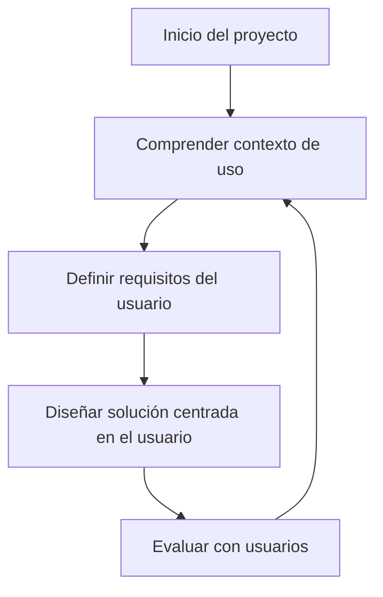

# Diseño centrado en el usuario (DCU)

El **Diseño Centrado en el Usuario (DCU)** es un enfoque de diseño que pone **al usuario como eje principal** de todas las decisiones durante la creación de un producto. Se basa en la **comprensión profunda de las necesidades, expectativas, contexto, capacidades y limitaciones** de los usuarios reales.

Este modelo busca garantizar que el sistema sea **útil, usable y deseado**, no solo funcional desde un punto de vista técnico.

## Etapas del proceso DCU (ISO 9241-210)

La ISO 9241-210 (Ergonomía de la interacción hombre-sistema) comparte las siguientes etapas:

1. **Comprender el contexto de uso:** ¿Quiénes son los usuarios? ¿Qué hacen? ¿Dónde y cómo usan el sistema?
2. **Especificar los requisitos del usuario:** Recolectar y documentar lo que los usuarios necesitan para alcanzar sus objetivos.
3. **Diseñar soluciones centradas en el usuario:** Crear wireframes, mockups, prototipos interactivos y escenarios de uso.
4. **Evaluar el diseño con usuarios:** Pruebas de usabilidad, entrevistas, A/B testing, observación directa.

Estas etapas son iterativas y no lineales. El feedback constante guía mejoras continuas.



## Ejemplo técnico

**Caso**: Formulario de solicitud de beca para estudiantes

**Versión basada en suposiciones (sin DCU)**:

```html showLineNumbers
<input type="text" placeholder="Número de radicado" />
```

**Problemas**:

- El estudiante no sabe qué es un "radicado".
- No hay ayuda ni explicación.
- No se valida nada

**Versión centrada en el usuario**:

```html showLineNumbers
<label for="document">Número de documento</label>
<input
  id="document"
  type="text"
  formControlName="document"
  aria-describedby="docHelp"
  placeholder="Ej: 123456789"
  required
/>
<small id="docHelp">Usa tu número de identidad, sin puntos ni guiones.</small>
```

**Aplicaciones del DCU**:

- Lenguaje claro y familiar.
- Ayuda contextual (aria-describedby).
- Validación visible.

## Implicaciones en la realidad

|Contexto|Aplicación del DCU|
|--|--|
|Educación|Diseño de plataformas LMS personalizadas.|
|Gobierno digital|Formularios claros, accesibles, inclusivos.|
|Salud|Apps para pacientes mayores o discapacitados.|
|Comercio|Reducción de abandono de compra con pruebas de usuario.|

## Relación con buenas prácticas

|Práctica|Enfoque DCU aplicado|
|--|--|
|Entender necesidades reales|Investigación de usuarios|
|Diseñar desde el lenguaje del usuario|Interfaz accesible y comprensible|
|Prototipado temprano|Validación antes de codificar|
|Feedback continuo|Ciclos iterativos de mejora|
|Empatía|Decisiones que consideran emociones|

## Referencias

- ISO 9241-210. (2019). Ergonomics of human-system interaction – Part 210: Human-centred design for interactive systems. International Organization for Standardization.
- Norman, D. (2013). [The Design of Everyday Things (Rev. Ed.)](https://www.jnd.org/books/the-design-of-everyday-things-revised-and-expanded-edition.html). Basic Books.
- Garrett, J. J. (2010). The Elements of User Experience. New Riders.
- Krug, S. (2014). Don't Make Me Think. New Riders.
- [Angular Accessibility Guide](https://angular.io/guide/accessibility)
