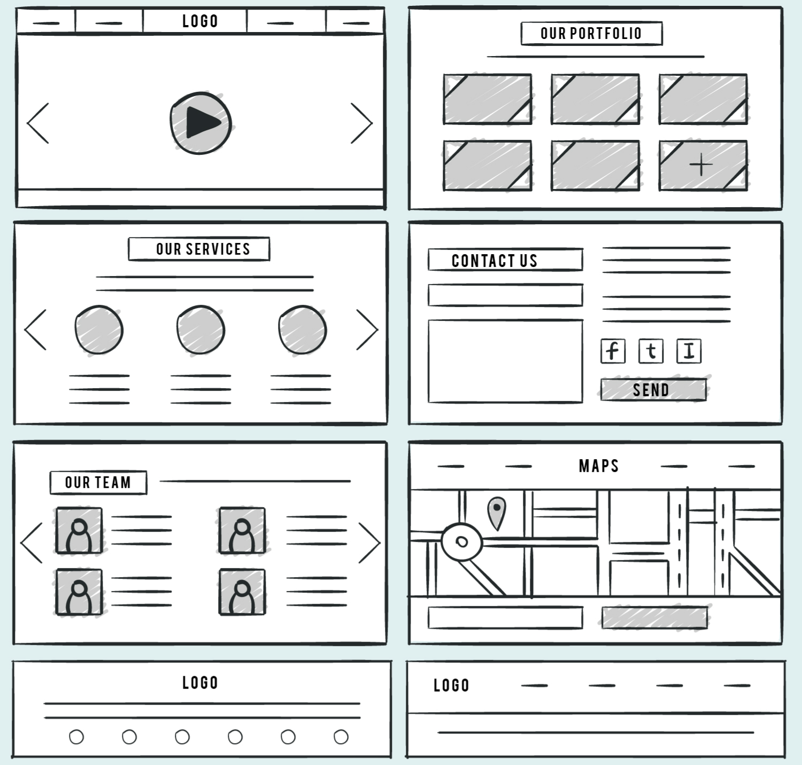
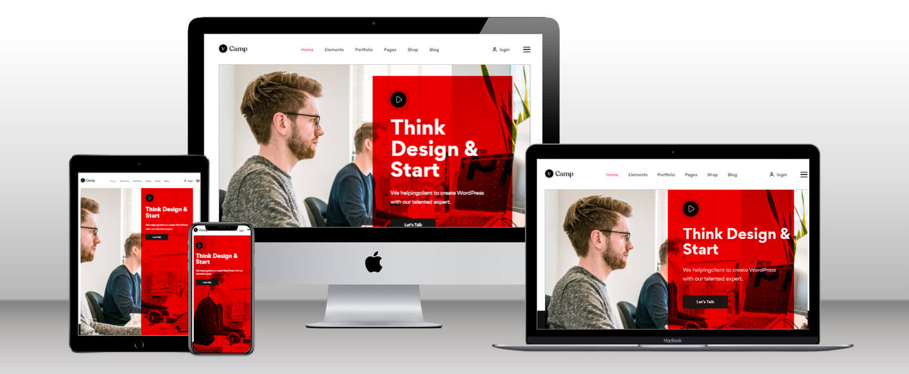
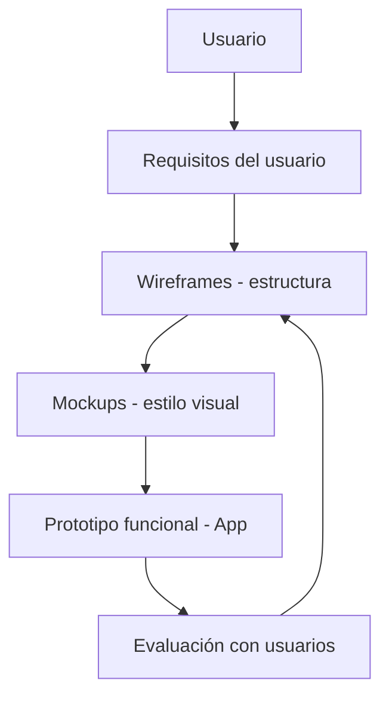

# ¿Qué es un wireframe y un mockup?

## ¿Qué es un Wireframe?

Un **wireframe** es un esquema visual básico que representa la **estructura funcional de una pantalla**, sin detalles de diseño visual. Su propósito es **planificar la disposición de los elementos de la interfaz** (botones, menús, formularios) y mostrar cómo se conectan las pantallas entre sí.

- Enfocado en: **estructura, navegación, jerarquía**.
- No incluye: colores, imágenes, estilos finales.
- Herramientas comunes: papel y lápiz, Balsamiq, Figma (modo low-fidelity), Adobe XD.



:::success
El **wireframe** responde a la pregunta: “**¿Qué debe haber y dónde?**”
:::

## ¿Que es un Mockup?

Un **mockup** es una **representación estática de alta fidelidad** que muestra **cómo se verá la interfaz final**, incluyendo tipografía, paleta de colores, íconos, imágenes y espaciado.

- Enfocado en: **aspecto visual, branding, estilo gráfico**.
- Herramientas comunes: Figma, Adobe XD, Sketch, InVision.



:::success
El **mockup** responde a la pregunta: “**¿Cómo se verá y se sentirá la interfaz?**”
:::

## Diferencias clave

|Característica|Wireframe|Mockup|
|--|--|--|
|Nivel de detalle|Bajo (low-fidelity)|Alto (high-fidelity)|
|Propósito|Planificación estructural |Diseño visual|
|Colores, imágenes|No|Sí|
|Tipografía final|No|Sí|
|Ideal para|Inicio de proyecto|Presentaciones a stakeholders|

## Proceso visual desde DCU



## Ejemplo técnico

**Wireframe de pantalla de login**:

```txt
+--------------------------+
|         Login            |
+--------------------------+
| Email: [__________**]    |
| Password: [**________]   |
| [ Iniciar sesión ]       |
| ¿Olvidaste tu clave?     |
+--------------------------+
```

> Aquí nos interesa la **ubicación** y **orden de los elementos**, no su estilo.

**Mockup (Figma o CSS en Angular)**:

```css
.login-form {
  background-color: #ffffff;
  border-radius: 12px;
  padding: 2rem;
  box-shadow: 0 4px 10px rgba(0,0,0,0.1);
}

.login-form button {
  background-color: #0057ff;
  color: white;
  border-radius: 8px;
  padding: 0.75rem;
}
```

> Aquí aplicamos **colores institucionales**, **sombras**, **tipografía**, y **estilo de marca (branding)**.

## Implicaciones comunes

|Proyecto|Uso del wireframe y mockup|
|--|--|
|App universitaria|Wireframe para planificar menús; mockup con paleta institucional|
|Ecommerce|Wireframe para flujo de compra; mockup para presentación al cliente|
|Gobierno digital|Wireframes accesibles; mockups con estilo inclusivo|
|Plataformas educativas|Wireframes con jerarquía didáctica; mockups visuales atractivos|

## Buenas prácticas

|Práctica UX/UI|Aplicación en wireframes/mockups|
|--|--|
|Separar estructura de estilo|Wireframe primero, luego mockup|
|Pensar en el usuario|¿Qué acciones debe realizar fácilmente?|
|Iterar con poco costo|Wireframes rápidos para probar flujos|
|Aplicar identidad visual|Mockups con branding y accesibilidad|
|Validar antes de codificar|Ahorrar tiempo con feedback temprano|

## Referencias

- Garrett, J. J. (2010). The Elements of User Experience. New Riders.
- Krug, S. (2014). Don't Make Me Think: A Common Sense Approach to Web Usability. New Riders.
- Norman, D. (2013). The Design of Everyday Things. Basic Books.
- [Figma Docs](https://help.figma.com/hc/en-us)
- Nielsen Norman Group. (2020). [Wireframes vs Mockups vs Prototypes](https://www.nngroup.com/articles/wireframe-mockup-prototype/)
