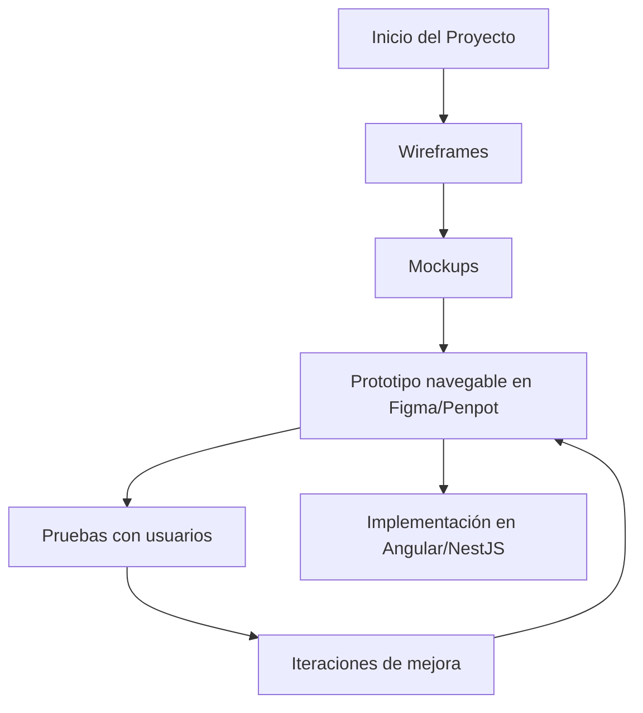

# Uso básico de Figma o Penpot para prototipos

Un **prototipo** es una representación **interactiva y funcional simulada** de un producto digital que permite **probar flujos, interacciones y navegación**, sin necesidad de codificar.

En el contexto de **UX/UI**, los prototipos permiten:

- Validar ideas con usuarios reales antes de desarrollar.
- Mostrar el recorrido del usuario (User Flow).
- Recoger feedback y mejorar iterativamente.

## Comparación entre Figma y Penpot

|Herramienta|Características clave|
|--|--|
|**Figma**|Basada en la nube, colaborativa en tiempo real, interfaz intuitiva, plantillas.|
|**Penpot**|Open-source, gratuita, ideal para software libre y proyectos educativos.|

Ambas permiten crear **wireframes**, **mockups** y **prototipos navegables**. Figma tiene una curva de aprendizaje más suave y más documentación; Penpot es excelente para contextos de soberanía digital.

En ambos se puede diseñar:

- Pantallas de inicio, login, dashboard.
- Flujos de usuario (signup → formulario → confirmación).
- Menús, botones, tarjetas, formularios.
- Navegación simulada entre pantallas.

## Ejemplo: Crear un prototipo navegable

**Proyecto:** App de gestión de tareas académicas

1. Paso 1: Crear frames o páginas
   - Frame 1: Pantalla de login
   - Frame 2: Dashboard con lista de tareas
   - Frame 3: Formulario de nueva tarea
2. Paso 2: Diseñar elementos en cada pantalla
   - Usa herramientas de forma (rectángulo, texto, input).
   - Crea botones con estados (normal, hover).
   - Usa íconos o componentes predefinidos si están disponibles.
3. Paso 3: Prototipar
   - En Figma:
     - Selecciona el botón → haz clic en Prototype.
     - Arrastra una flecha hasta el frame de destino.
     - Define la interacción: On Click → Navigate to → Frame.
   - En Penpot:
     - Activa el modo "Prototype".
     - Conecta elementos interactivos entre pantallas.
     - Exporta o prueba el prototipo desde el visor.

## Buenas prácticas recomendadas

|Práctica|Relación con Figma/Penpot|
|--|--|
|Iteración rápida|Probar ideas sin escribir código|
|Diseño colaborativo|Edición simultánea, comentarios|
|Feedback temprano|Pruebas con usuarios en prototipos|
|Uso de componentes reutilizables|Construcción coherente y escalable|
|Separar diseño de desarrollo|Evita retrabajo innecesario en Angular/NestJS|

## Flujo de creación de prototipo

## Referencias

- Garrett, J. J. (2010). The Elements of User Experience. New Riders.
- Norman, D. A. (2013). The Design of Everyday Things. Basic Books.
- Nielsen Norman Group. (2020). [Prototyping 101.](https://www.nngroup.com/articles/prototyping-101/)
- [Figma Help Center](https://help.figma.com/)
- [Penpot Docs](https://penpot.app/docs)
