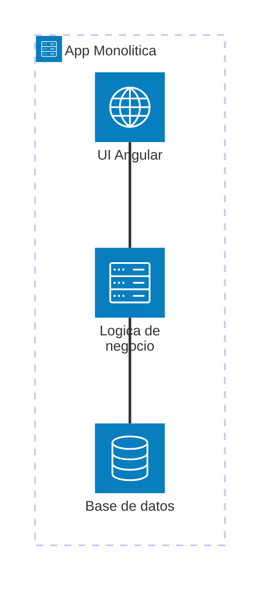
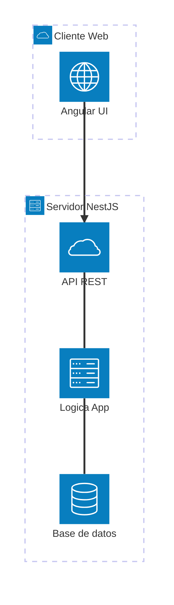
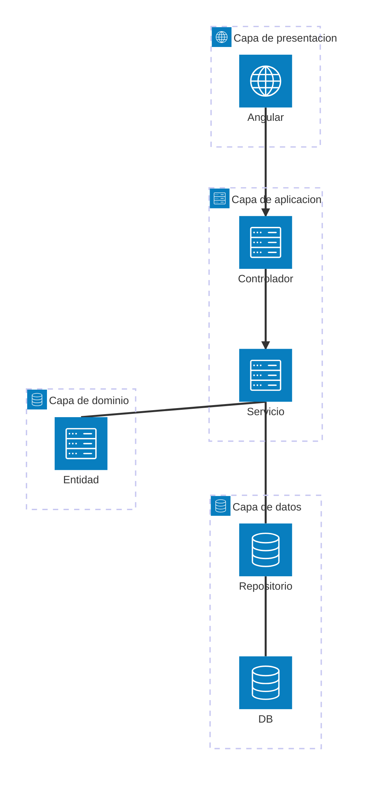
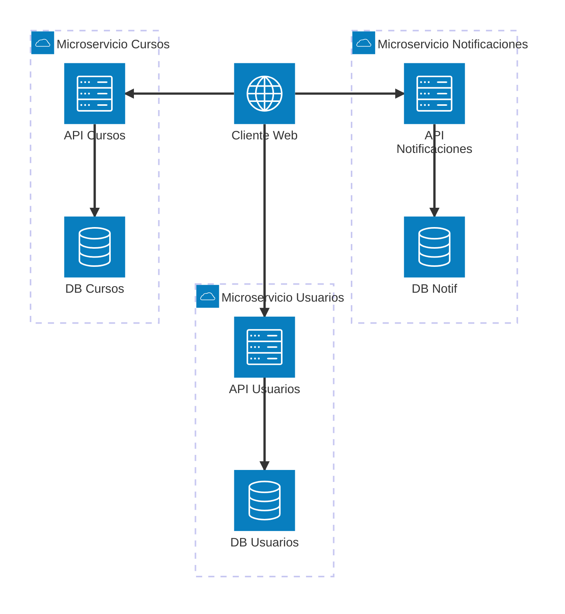
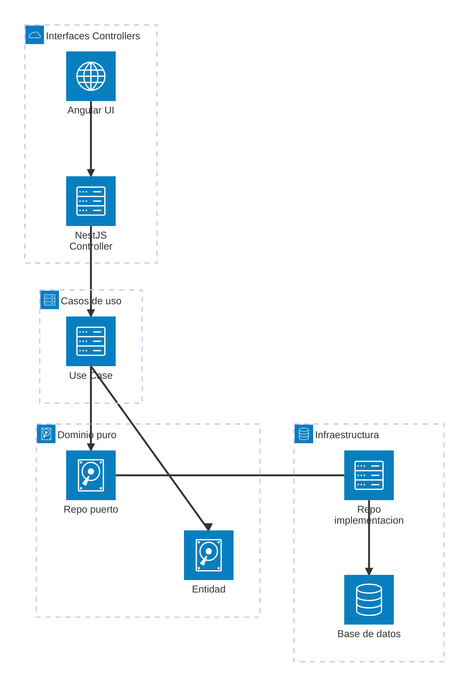
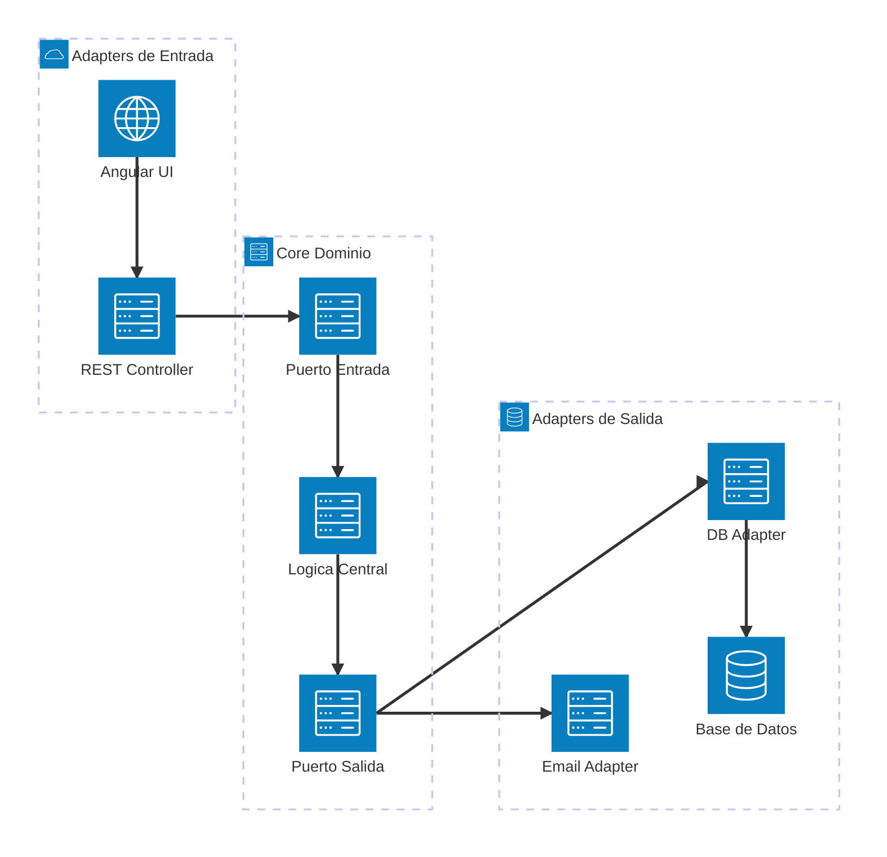

# ¿Qué es arquitectura de software?

La **arquitectura de software** es la estructura fundamental de un sistema de software, definida por sus **componentes, relaciones y propiedades**. Incluye tanto las decisiones estructurales como las no estructurales (rendimiento, escalabilidad, seguridad, etc.).

Es como el plano de un edificio: no especifica todos los detalles, pero define los pilares, entradas, salidas y distribución general.

## ¿Por qué es importante?

Una buena arquitectura permite que el software sea:

- **Escalable:** crecer sin romperse.
- **Mantenible:** fácil de modificar y entender.
- **Reutilizable:** módulos independientes y adaptables.
- **Probable y confiable:** se pueden aislar y probar sus partes.
- **Segura y eficiente.**

## Elementos clave de la arquitectura de software

|Elemento|Descripción|
|--|--|
|**Módulos o capas**|Partes independientes con funciones específicas (ej: UI, lógica, datos).|
|**Componentes**|Unidades funcionales reutilizables que interactúan entre sí.|
|**Conectores**|Relaciones o mecanismos de comunicación entre módulos.|
|**Decisiones arquitectónicas**|Patrones, lenguajes, frameworks, estilos seleccionados.|

## Estilos arquitectónicos comunes

|Estilo|Características clave|
|--|--|
|**Monolítico**|Todo en una sola unidad. Simple, pero poco flexible.|
|**Cliente–Servidor**|Separación entre UI y lógica/datos del servidor.|
|**Capas (Layered)**|Separación en UI, lógica, servicios, datos. Muy usado.|
|**Microservicios**|Componentes independientes comunicados por API.|
|**Clean Architecture**|Lógica de negocio separada de frameworks y delivery.|
|**Hexagonal (Ports & Adapters)**|Aísla el núcleo de cualquier infraestructura externa.|

### Monolítica



**Características:**

- Todo el sistema en un solo bloque desplegable.
- Fácil de desarrollar inicialmente, pero difícil de escalar o mantener en el tiempo.
- Usado en prototipos rápidos o MVPs sencillos.

### Cliente-Servidor



**Características:**

- Separación clara entre frontend y backend.
- Modelo ideal para apps web tradicionales.
- Base de casi todas las arquitecturas modernas.

### En Capas (Layered)



**Características:**

- Cada capa tiene una responsabilidad clara.
- Muy usado en contextos académicos y empresariales.
- Fácil de implementar en Angular (frontend) y NestJS (backend).

### Microservicios



**Características:**

- Cada microservicio tiene su propia base de datos y se despliega por separado.
- Independencia tecnológica y de equipos.
- Alta complejidad en la gestión e infraestructura.

### Clean Architecture



**Características:**

- El dominio no depende de frameworks externos.
- Alta mantenibilidad y testabilidad.
- Ideal para proyectos grandes y educativos que requieren buenas prácticas.

### Hexagonal (Ports & Adapters)



**Características:**

- Core aislado de toda tecnología externa.
- Las dependencias apuntan hacia el dominio.
- Muy utilizada en sistemas donde hay múltiples interfaces (web, móvil, APIs externas).

## Ejemplo técnico

Supongamos una aplicación para registrar asistencia a clases. Podríamos diseñarla con Clean Architecture:

```txt
frontend/ (Angular)
  └── app/
      ├── core/           → lógica de negocio
      ├── features/       → módulos funcionales (asistencia, usuarios)
      └── shared/         → componentes reutilizables

backend/ (NestJS)
  └── src/
      ├── domain/         → entidades y reglas
      ├── application/    → casos de uso (services)
      ├── infrastructure/ → controladores y persistencia
      └── interfaces/     → adaptadores de entrada y salida
```

En esta arquitectura se separa el **dominio puro** de la **infraestructura**, por ejemplo al momento de crear un caso de uso en el backend:

```ts title="src/application/use-cases/register-attendance.use-case.ts" showLineNumbers
@Injectable()
export class RegisterAttendanceUseCase {
  constructor(private readonly repository: AttendanceRepository) {}

  async execute(dto: RegisterAttendanceDto): Promise<void> {
    const record = new Attendance(dto.userId, dto.date);
    await this.repository.save(record);
  }
}
```

## Aplicaciones prácticas

|Contexto|Aplicación de arquitectura de software|
|--|--|
|Educación|Proyectos estudiantiles organizados por capas|
|Startups|Microservicios para escalar módulos independientes|
|Backend gubernamental|Arquitectura hexagonal para integrar sistemas externos|
|Apps móviles y web|Clean Architecture para compartir lógica entre front y back|

## Referencias

- Bass, L., Clements, P., & Kazman, R. (2012). [Software Architecture in Practice (3rd ed.)](https://www.informit.com/store/software-architecture-in-practice-9780321815736). Addison-Wesley.
- Martin, R. C. (2017). [Clean Architecture: A Craftsman's Guide to Software Structure and Design](https://www.oreilly.com/library/view/clean-architecture-a/9780134494272/). Pearson.
- Richards, M., & Ford, N. (2020). [Fundamentals of Software Architecture](https://www.oreilly.com/library/view/fundamentals-of-software/9781492043447/). O’Reilly.
- [Angular Docs](https://angular.io/guide/architecture)
- [NestJS Docs](https://docs.nestjs.com/)
