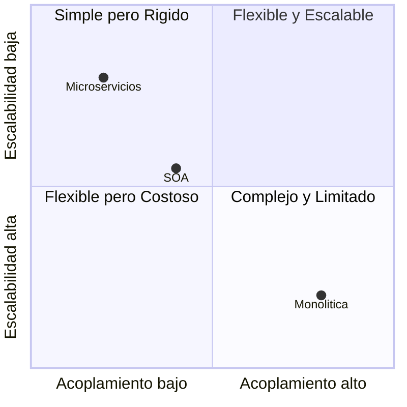

# Estilos arquitectónicos comunes (Monolítica, SOA, Microservicios)

## Arquitectura Monolítica

En este estilo, todo el sistema está contenido en una sola unidad de despliegue. Incluye lógica de negocio, interfaz de usuario y acceso a datos en un solo paquete.

**Ventajas:**

- Sencilla de desarrollar y desplegar.
- Buena opción para MVPs y proyectos pequeños.

**Desventajas:**

- Difícil de escalar por partes.
- Bajo aislamiento de fallos.
- Cambios pequeños requieren reempaquetar todo.

## Arquitectura SOA (Service-Oriented Architecture)

La arquitectura orientada a servicios (SOA) se basa en componentes llamados servicios que interactúan a través de un bus de comunicación común, como SOAP, JMS o incluso REST en implementaciones modernas.

**Ventajas:**

- Reutilización de servicios en diferentes contextos.
- Separación entre servicios de negocio e infraestructura.

**Desventajas:**

- Uso de buses de comunicación complejos.
- Overhead por estandarización y gestión centralizada.

## Arquitectura de Microservicios

Divide el sistema en múltiples servicios independientes, cada uno con su propia lógica y base de datos. Se comunican generalmente a través de REST o mensajes asíncronos.

**Ventajas:**

- Escalabilidad independiente.
- Despliegue desacoplado.
- Facilidad de mantenimiento en equipos grandes.

**Desventajas:**

- Complejidad de orquestación y monitoreo.
- Costos mayores en infraestructura.

## Ejemplos técnicos con Angular/NestJS

**Monolítica:**

Una sola aplicación NestJS que sirve HTML o API, y Angular acoplado directamente.

```txt
Sistema de gestión académica
├── NestJS: Controladores, servicios, base de datos
├── Angular: Servido por el mismo servidor
```

**SOA:**

Servicios independientes expuestos en un bus (ej. GraphQL Gateway), llamados desde una SPA en Angular.

Servicios independientes:

- Servicio de usuarios
- Servicio de materias
- Servicio de pagos

Angular consume todos los servicios desde un orquestador.

**Microservicios:**

Cada módulo (usuarios, tareas, pagos) corre como servicio NestJS aislado, con su DB. Angular consume desde un API Gateway o directamente.

## Aplicaciones prácticas

|Estilo|Aplicación común|
|--|--|
|Monolítica|MVPs, apps educativas pequeñas, demostraciones.|
|SOA|Empresas con múltiples canales y servicios integrados.|
|Microservicios|Startups y empresas que necesitan escalar rápidamente.|

## Diagrama de Cuadrantes

**Arquitecturas según Acoplamiento y Escalabilidad:**



|Cuadrante|Características clave|
|--|--|
|**Flexible y Escalable**|Bajo acoplamiento + alta escalabilidad → *Microservicios*|
|**Flexible pero Costoso**|Bajo acoplamiento + baja escalabilidad → *SOA*|
|**Simple pero Rígido**|Alto acoplamiento + alta escalabilidad → (raro)|
|**Complejo y Limitado**|Alto acoplamiento + baja escalabilidad → *Monolítica*|

## Referencias

- Bass, L., Clements, P., & Kazman, R. (2012). [Software Architecture in Practice (3rd ed.)](https://www.informit.com/store/software-architecture-in-practice-9780321815736). Addison-Wesley.
- Richards, M., & Ford, N. (2020). [Fundamentals of Software Architecture.](https://www.oreilly.com/library/view/fundamentals-of-software/9781492043447/) O’Reilly.
- Martin, R. C. (2017). [Clean Architecture: A Craftsman's Guide to Software Structure and Design](https://www.oreilly.com/library/view/clean-architecture-a/9780134494272/). Pearson.
- [Angular Docs](https://angular.io/guide/architecture)
- [NestJS Docs](https://docs.nestjs.com)
