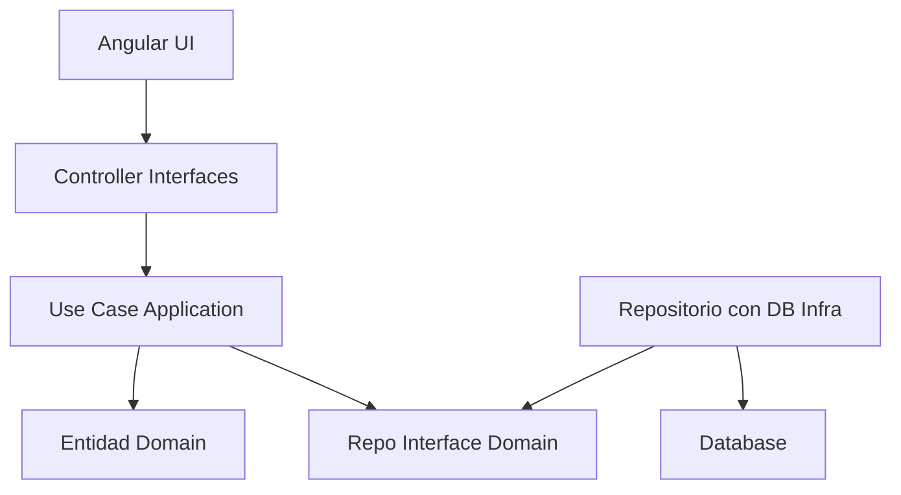
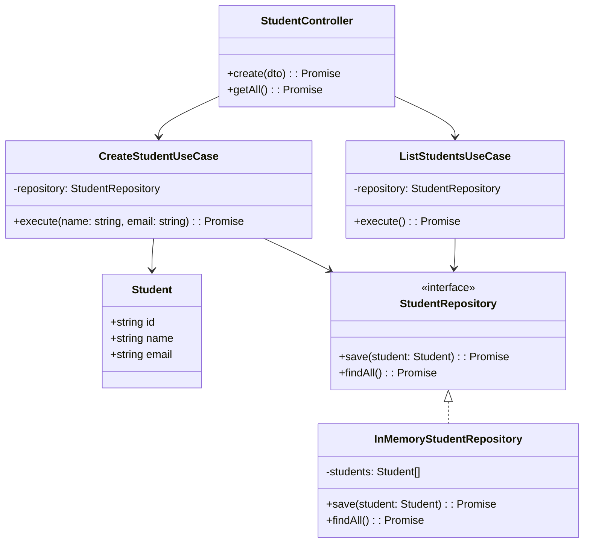
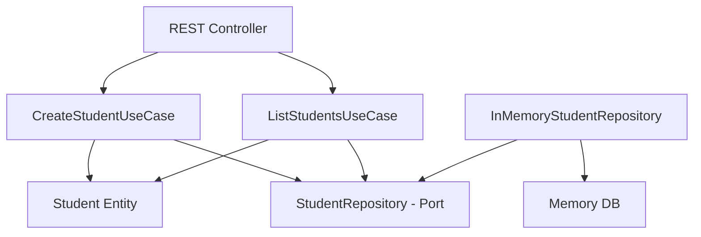
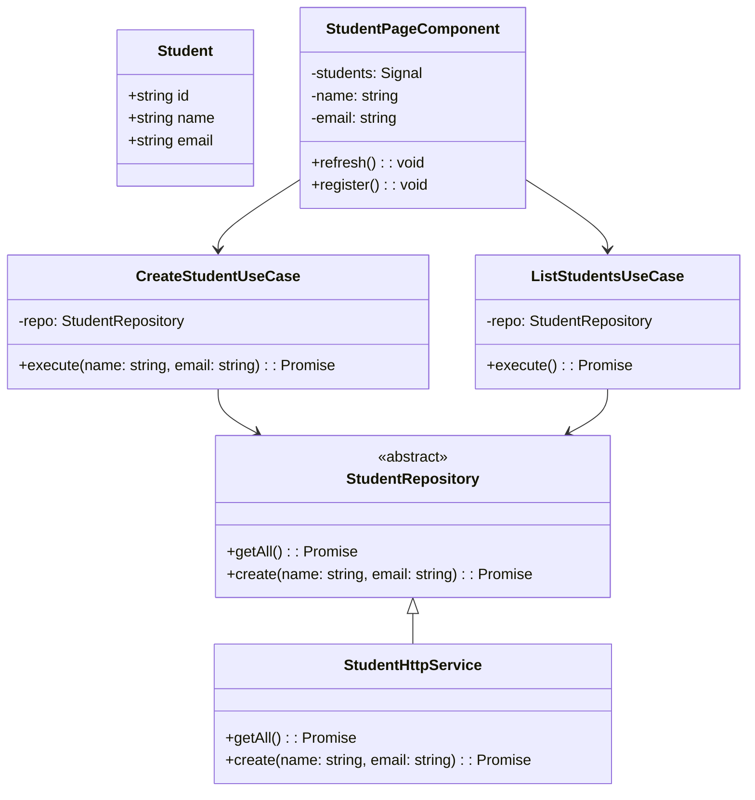
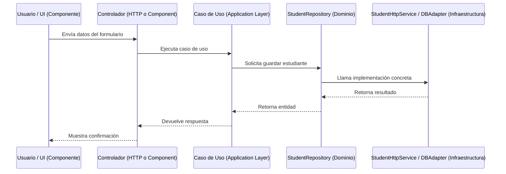

# Principios de Clean Architecture

**Clean Architecture** (Arquitectura Limpia) es un estilo arquitectónico propuesto por **Robert C. Martin** ("Uncle Bob"), que busca separar de forma estricta la lógica de negocio (núcleo) de los detalles de implementación como frameworks, bases de datos, controladores, interfaces o UI. El objetivo es crear software **independiente, mantenible, testable y adaptable**, sin depender de frameworks, bases de datos o dispositivos externos.

## Capas de Clean Architecture

|Capa|Propósito principal|
|--|--|
|**Entities (Dominio)**|Contiene reglas de negocio centrales, independientes del sistema.|
|**Use Cases (Aplicación)**|Orquesta entidades para cumplir reglas específicas de negocio.|
|**Interface Adapters**|Convierte datos entre formatos externos y el modelo interno.|
|**Frameworks & Drivers**|Bases de datos, frameworks (Angular/NestJS), UI, herramientas externas.|



## Principio de dependencia (Dependency Rule)

:::info

***"El código de capas externas puede depender de capas internas, pero nunca al revés."***

:::

Esto significa que:

- Entidades **no conocen** nada de controladores o base de datos.
- Casos de uso **usan interfaces (puertos)** para acceder a repositorios o servicios externos.
- La dirección de las dependencias siempre apunta **hacia el dominio**.

## Ejemplo de uso NestJS

```txt
src/
├── domain/
│   ├── entities/
│   │   └── student.entity.ts
│   └── repositories/
│       └── student.repository.ts
│
├── application/
│   ├── use-cases/
│   │   ├── create-student.usecase.ts
│   │   └── list-students.usecase.ts
│   └── services.module.ts
│
├── infrastructure/
│   └── persistence/
│       └── in-memory-student.repository.ts
│
├── interfaces/
│   └── rest/
│       └── student.controller.ts
│
└── main.ts
```



import Tabs from "@theme/Tabs";
import TabItem from "@theme/TabItem";

<Tabs>
<TabItem value="entidad" label="Domain">

Esta capa contiene **el corazón de la aplicación**, es decir, las reglas y estructuras fundamentales del negocio. **No depende de ningún framework ni librería externa**.

```ts title="domain/entities/student.entity.ts" showLineNumbers
export class Student {
  constructor(
    public readonly id: string,
    public name: string,
    public email: string
  ) {}
}
```

La entidad `Student` se encarga de representar a un estudiante con sus datos esenciales (`id`, `name`, `email`), además, define el modelo de negocio: lo que significa ser un "estudiantes". Esta entidad es utilizada por los **casos de uso** para crear y manipular estudiantes, y es persistida por los **repositorios**.

```ts title="domain/repositories/student.repository.ts" showLineNumbers
import { Student } from '../entities/student.entity';

export interface StudentRepository {
  save(student: Student): Promise<void>;
  findAll(): Promise<Student[]>;
}
```

`StudentRepository` es una interfaz que define **lo que debe hacer un repositorio** de estudiantes, sin decir cómo. Funciona como un contrato (puerto) para persistencia, el cual es usado por los casos de uso, e implementado por la capa de infraestructura.

</TabItem>
<TabItem value="use-case" label="Application">

Aquí definimos la **lógica específica** que permite ejecutar acciones concretas en el sistema: **los casos de uso**. Esta capa orquesta el dominio, pero no conoce controladores ni bases de datos.

```ts title="application/use-cases/create-student.usecase.ts" showLineNumbers
import { StudentRepository } from '../../domain/repositories/student.repository';
import { Student } from '../../domain/entities/student.entity';
import { v4 as uuid } from 'uuid';

export class CreateStudentUseCase {
  constructor(private readonly repository: StudentRepository) {}

  async execute(name: string, email: string): Promise<Student> {
    const student = new Student(uuid(), name, email);
    await this.repository.save(student);
    return student;
  }
}
```

`CreateStudentUseCase` es quien recibe los datos del estudiante, crea una nueva instancia de `Student`, y usa el repositorio para guardarlo. Esta clase es llamada desde el controlador (interfaces) para responder a peticiones `POST`, y adicional usa el **repositorio** como interfaz pero sin conocer la implementación.

```ts title="application/use-cases/list-students.usecase.ts" showLineNumbers
import { StudentRepository } from '../../domain/repositories/student.repository';
import { Student } from '../../domain/entities/student.entity';

export class ListStudentsUseCase {
  constructor(private readonly repository: StudentRepository) {}

  async execute(): Promise<Student[]> {
    return this.repository.findAll();
  }
}
```

La clase `ListStudentsUseCase` recupera todos los estudiantes registrados. Es usado por el controlador para responder peticiones `GET`, a su vez, usa el repositorio y devuelve entidades del dominio.

```ts title="application/services.module.ts" showLineNumbers
import { Module } from '@nestjs/common';
import { InMemoryStudentRepository } from '../infrastructure/persistence/in-memory-student.repository';
import { CreateStudentUseCase } from './use-cases/create-student.usecase';
import { ListStudentsUseCase } from './use-cases/list-students.usecase';

@Module({
  providers: [
    {
      provide: 'StudentRepository',
      useClass: InMemoryStudentRepository,
    },
    {
      provide: CreateStudentUseCase,
      useFactory: (repo) => new CreateStudentUseCase(repo),
      inject: ['StudentRepository'],
    },
    {
      provide: ListStudentsUseCase,
      useFactory: (repo) => new ListStudentsUseCase(repo),
      inject: ['StudentRepository'],
    },
  ],
  exports: [CreateStudentUseCase, ListStudentsUseCase],
})
export class ServicesModule {}
```

Dentro del módulo `ServiceModule`, se registra todas las dependencias necesarias para que NestJS inyecte correctamente los objetos:

- Se registra que `StudentRepository` se implementa con `InMemoryStudentRepository`.
- Se crea manualmente cada `UseCase`, inyectándole el repositorio adecuado.

Esto permite que los casos de uso estén completamente desacoplados de la infraestructura y puedan ser fácilmente probados o modificados.

</TabItem>
<TabItem value="adapter" label="Infrastructure">

Esta capa contiene la **implementación concreta** de los puertos definidos en el dominio. Aquí vive el código que **interactúa con tecnologías externas:** bases de datos, APIs, archivos, etc.

```ts title="infrastructure/persistence/in-memory-student.repository.ts" showLineNumbers
import { Injectable } from '@nestjs/common';
import { Student } from '../../domain/entities/student.entity';
import { StudentRepository } from '../../domain/repositories/student.repository';

@Injectable()
export class InMemoryStudentRepository implements StudentRepository {
  private readonly students: Student[] = [];

  async save(student: Student): Promise<void> {
    this.students.push(student);
  }

  async findAll(): Promise<Student[]> {
    return this.students;
  }
}
```

En este ejemplo, `InMemoryStudentRepository` se encarga de guardar estudiantes en un arreglo local, es decir, en memoria. También, simula una base de datos para pruebas o prototipos. Esta clase implemente la interfaz `StudentRepository`, y es inyectada por NestJS como dependencia de los casos de uso.

</TabItem>
<TabItem value="controlador" label="Interfaces">

Esta es la capa más externa. Aquí conectamos al usuario (frontend, HTTP, etc.) con el resto del sistema. En este caso, usamos **NestJS** como framework para servir endpoints REST.

```ts title="interfaces/rest/student.controller.ts" showLineNumbers
import { Body, Controller, Get, Post } from '@nestjs/common';
import { CreateStudentUseCase } from '../../application/use-cases/create-student.usecase';
import { ListStudentsUseCase } from '../../application/use-cases/list-students.usecase';

@Controller('students')
export class StudentController {
  constructor(
    private readonly createUseCase: CreateStudentUseCase,
    private readonly listUseCase: ListStudentsUseCase
  ) {}

  @Post()
  async create(@Body() dto: { name: string; email: string }) {
    return this.createUseCase.execute(dto.name, dto.email);
  }

  @Get()
  async getAll() {
    return this.listUseCase.execute();
  }
}
```

El controlador `StudentController` expone 2 endpoints HTTP:

- `POST /students` para crear un estudiante
- `GET /students` para listar estudiantes.

Además, recibe los datos del cliente, se los pasa al caso de uso y devuelve una respuesta. Este controlador **llama a los casos de uso**, pero no conoce ni manipula la lógica interna ni la base de datos directamente.

</TabItem>
<TabItem value="main" label="Main">

El archivo `main.ts` es el punto de entrada principal de la aplicación, es el **bootstrap** de la aplicación NestJS. Es el lugar donde se crea y se inicia la aplicación. Es análogo al `main()` de otros lenguajes.

```ts title="main.ts" showLineNumbers
import { NestFactory } from '@nestjs/core';
import { Module } from '@nestjs/common';
import { ServicesModule } from './application/services.module';
import { StudentController } from './interfaces/rest/student.controller';

@Module({
  imports: [ServicesModule],
  controllers: [StudentController],
})
export class AppModule {}

async function bootstrap() {
  const app = await NestFactory.create(AppModule);
  await app.listen(3000);
}
bootstrap();
```

Aunque `main.ts` está fuera de las capas centrales, **conecta la infraestructura (NestJS) con las interfaces y casos de uso**. Es el lugar donde:

- Se arranca la app
- Se configuran globales (Validación, CORS, etc.)
- Se integran módulos construidos según Clean Architecture

</TabItem>
</Tabs>



## Ejemplo de uso Angular v17+

```txt
src/
├── app/
│   ├── domain/
│   │   ├── models/
│   │   │   └── student.model.ts
│   │   └── repositories/
│   │       └── student.repository.ts
│   │
│   ├── application/
│   │   └── use-cases/
│   │       ├── add-student.usecase.ts
│   │       └── get-students.usecase.ts
│   │
│   ├── infrastructure/
│   │   └── http/
│   │       ├── student-http.service.ts
│   │       └── student.dto.ts
│   │
│   ├── presentation/
│   │   └── pages/
│   │       └── student-page/
│   │           ├── student-page.component.ts
│   │           └── student-page.component.html
│   │
│   └── app.config.ts
```



<Tabs>
<TabItem value="entidad" label="Domain">

Esta capa define **qué es el sistema**, pero no cómo funciona técnicamente. No depende de Angular ni HTTP.

```ts title="src/app/domain/models/student.model.ts" showLineNumbers
export interface Student {
  id: string;
  name: string;
  email: string;
}
```

`Student` define la entidad estudiante. Es el tipo de dato que circula por todas las capas (modelo del negocio).

```ts title="src/app/domain/repositories/student.repository.ts" showLineNumbers
import { Student } from '../models/student.model';

export abstract class StudentRepository {
  abstract getAll(): Promise<Student[]>;
  abstract create(name: string, email: string): Promise<Student>;
}
```

Por otro lado, `student.repository.ts` define un contrato abstracto (interfaz) para acceder a datos de estudiantes. No indica **cómo** se conectará al backend (eso lo resuelve la infraestructura). El contrato es usado por los casos de uso, y es implementada por la infraestructura.

</TabItem>
<TabItem value="app" label="Application">

Aquí se encuentra la lógica que representa lo que el sistema puede hacer: **acciones específicas** como crear o listar estudiantes.

```ts title="src/app/application/use-cases/list-students.usecase.ts" showLineNumbers
import { inject } from '@angular/core';
import { StudentRepository } from '../../domain/repositories/student.repository';

export class ListStudentsUseCase {
  private repo = inject(StudentRepository);

  execute() {
    return this.repo.getAll();
  }
}
```

`ListStudentUseCase` recupera la lista de estudiantes, y llama al repositorio abstracto. Esta clase depende solo de `StudentRepository`, no de Angular, no de HTTP.

```ts title="src/app/application/use-cases/create-student.usecase.ts" showLineNumbers
import { inject } from '@angular/core';
import { StudentRepository } from '../../domain/repositories/student.repository';

export class CreateStudentUseCase {
  private repo = inject(StudentRepository);

  execute(name: string, email: string) {
    return this.repo.create(name, email);
  }
}
```

`CreateStudentUseCase` ejecuta la acción de registrar un nuevo estudiante, recibe datos y delega la persistencia al repositorio. Ambas clases son usadas directamente por el componente `StudentPageComponent`

</TabItem>
<TabItem value="infra" label="Infrastructure">

Aquí se encuentra el código que **implementa técnicamente** cómo se conectan los casos de uso con servicios externos, como APIs HTTP.

```ts title="src/app/infrastructure/http/student.dto.ts" showLineNumbers
export interface CreateStudentDto {
  name: string;
  email: string;
}
```

Un DTO (Data Transfer Object), define la estructura del cuerpo esperado por el backend al registrar un estudiante.

```ts title="src/app/infrastructure/http/student-http.service.ts" showLineNumbers
import { Injectable } from '@angular/core';
import { HttpClient } from '@angular/common/http';
import { Student } from '../../domain/models/student.model';
import { StudentRepository } from '../../domain/repositories/student.repository';
import { CreateStudentDto } from './student.dto';

@Injectable({ providedIn: 'root' })
export class StudentHttpService extends StudentRepository {
  private readonly url = 'http://localhost:3000/students';

  constructor(private http: HttpClient) {
    super();
  }

  getAll(): Promise<Student[]> {
    return this.http.get<Student[]>(this.url).toPromise();
  }

  create(name: string, email: string): Promise<Student> {
    const dto: CreateStudentDto = { name, email };
    return this.http.post<Student>(this.url, dto).toPromise();
  }
}
```

`StudentHttpService` implementa `StudentRepository` usando `HttpClient` y ejecuta llamadas HTTP a `http://localhost:3000/students`. Esta clase es **registrada como implementación** del repositorio abstracto, además de ser inyectada por Angular en los casos de uso a través de `app.config.ts`.

</TabItem>
<TabItem value="presentation" label="Presentation">

Aquí radica la **interfaz visual**. Es lo que el usuario ve y con lo que interactúa.

```ts title="src/app/presentation/pages/student-page/student-page.component.ts" showLineNumbers
import { Component, inject, signal, OnInit } from '@angular/core';
import { Student } from '../../../domain/models/student.model';
import { CreateStudentUseCase } from '../../../application/use-cases/create-student.usecase';
import { ListStudentsUseCase } from '../../../application/use-cases/list-students.usecase';

@Component({
  selector: 'app-student-page',
  standalone: true,
  templateUrl: './student-page.component.html',
})
export class StudentPageComponent implements OnInit {
  students = signal<Student[]>([]);
  name = '';
  email = '';

  private listUseCase = inject(ListStudentsUseCase);
  private createUseCase = inject(CreateStudentUseCase);

  ngOnInit(): void {
    this.refresh();
  }

  async refresh() {
    this.students.set(await this.listUseCase.execute());
  }

  async register() {
    await this.createUseCase.execute(this.name, this.email);
    this.name = '';
    this.email = '';
    await this.refresh();
  }
}
```

`StudentPageComponent` muestra un formulario para registrar estudiantes, usa Signals para manejar el estado reactivo de la lista, y llama directamente a los casos de uso. Este componente orquesta la presentación y los casos de uso, no conoce el backend ni HttpClient directamente.

```html title="src/app/presentation/pages/student-page/student-page.component.html" showLineNumbers
<h2>Registrar estudiante</h2>
<input placeholder="Nombre" [(ngModel)]="name" />
<input placeholder="Email" [(ngModel)]="email" />
<button (click)="register()">Registrar</button>

<h2>Lista de estudiantes</h2>
<ul>
  @for (student of students(); track student.id) {
    <li>{{ student.name }} ({{ student.email }})</li>
  } @empty {
    <li>No items available</li>
  }
</ul>
```

</TabItem>
<TabItem value="provider" label="Proveedor abstracto">

`app.config.ts` le dice a Angular que siempre que se pida un `StudentRepository`, use la clase `StudentHttpService`. Es el pegamento que une el **dominio abstracto** con la **infraestructura concreta**.

```ts title="src/app/app.config.ts" showLineNumbers
import { ApplicationConfig, importProvidersFrom } from '@angular/core';
import { provideHttpClient, withInterceptors } from '@angular/common/http';
import { StudentRepository } from './domain/repositories/student.repository';
import { StudentHttpService } from './infrastructure/http/student-http.service';

export const appConfig: ApplicationConfig = {
  providers: [
    provideHttpClient(),
    {
      provide: StudentRepository,
      useClass: StudentHttpService,
    },
  ],
};
```

</TabItem>
</Tabs>

## Diagrama de secuencias



## Buenas prácticas

|Principio|Aplicación en Clean Architecture|
|--|--|
|**Separación de responsabilidades**|Cada capa tiene un rol bien definido|
|**Inversión de dependencias**|Repositorios definidos como interfaces|
|**Independencia tecnológica**|El dominio no depende de NestJS o Angular|
|**Reutilización**|Casos de uso reutilizables desde REST o GraphQL|
|**Testabilidad**|Casos de uso y entidades fácilmente testeables|

## Referencias

- Martin, R. C. (2017). [Clean Architecture: A Craftsman's Guide to Software Structure and Design](https://www.oreilly.com/library/view/clean-architecture-a/9780134494272/). Pearson.
- Richards, M., & Ford, N. (2020). [Fundamentals of Software Architecture](https://www.oreilly.com/library/view/fundamentals-of-software/9781492043447/). O’Reilly.
- [NestJS Docs – Providers and Modules](https://docs.nestjs.com/)
- [Angular Docs – Architecture Overview](https://angular.io/guide/architecture)
