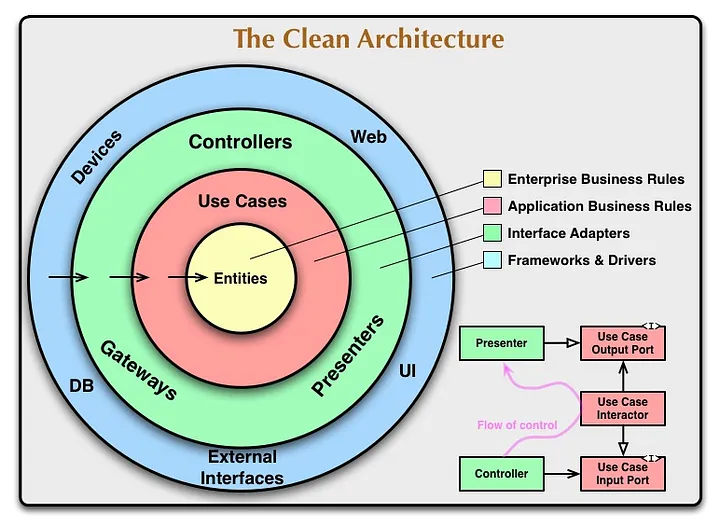
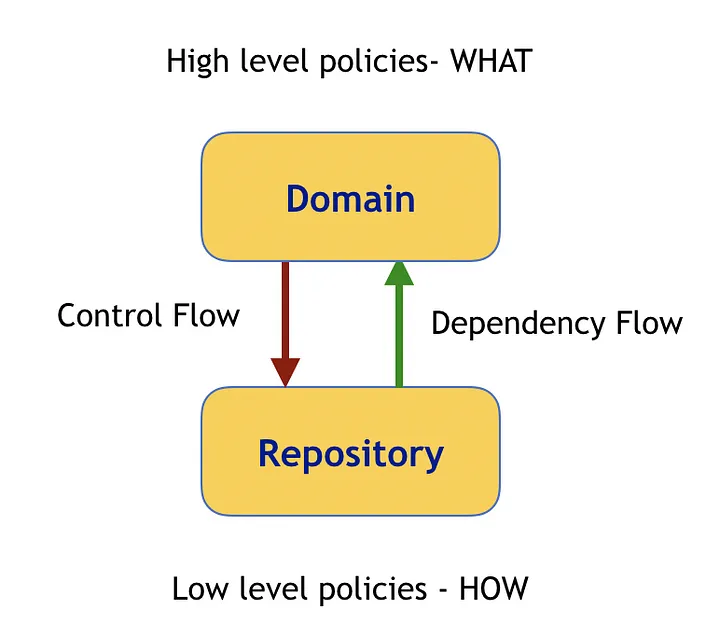

# Capas y dependencias en Clean Architecture

Clean Architecture es un enfoque de diseño de software propuesto por Robert C. Martin (Uncle Bob) que organiza el sistema en **capas concéntricas**. Su principal objetivo es **proteger la lógica de negocio** de las dependencias externas, permitiendo una alta **modularidad, mantenibilidad y testabilidad**.

## Capas fundamentales

- **Entidades**: Definen las entidades o modelos del negocio
- **Casos de uso**: Se define la lógica específica que permite ejecutar acciones concretas en el sistema.
- **Infraestructura**: Contiene la implementación concreta de los puertos definidos en el dominio.
- **Controladores**: Son la capa uqe conecta al usuario con el resto del sistema.
- **Capa de Frameworks y Herramientas**: Contiene el código que interactúa con bibliotecas, frameworks y herramientas externas. Es la capa más externa.

En

## Patrones de diseño involucrados

1. **Dependency Inversion Principle (DIP)**

   El principio de inversión de dependencias, aunque no es un patrón, es una de las bases primordiales del diseño dentro del Clean Architecture.

   :::success

   El código que implementa reglas de alto nivel, no debería depender de código que implementa detalles de bajo nivel. Por el contrario, los detalles deben depender de las reglas.

   :::

   

   Usando interfaces e inyección de dependencias se logra aplicar este concepto dentro del proyecto.

2. **Inversion of Control (IoC)**

   Es una técnica donde el control sobre la creación y manejo de objetos se delega a un contenedor de IoC. Este principio es aplicado con la inyección de dependencias, lo cual es esencial para mantener la independencia entre capas.

3. **Dependency Injection (Inyección de Dependencias)**

   Es un patrón que se utiliza para proporcionar las dependencias requeridas por una clase desde el exterior, en lugar de crearlas internamente. Esto ayuda a desacoplar las clases y facilita el reemplazo de las implementaciones sin modificar el código existente.

4. **Separation of Concerns (SoC) (Separación de Responsabilidades)**

   No es un patrón específico, sino un principio de diseño que busca dividir un sistema en componentes que tengan responsabilidades distintas y bien definidas. Esto es esencial para mantener una arquitectura limpia.

5. **Repository Pattern (Patrón Repositorio)**

   Es un patrón que se utiliza para encapsular el acceso a la capa de persistencia de datos. En la Clean Architecture, se usa para separar el acceso a la base de datos u otras fuentes de datos, permitiendo que la capa de negocio no dependa directamente de la infraestructura de datos.

6. **Use Case Interactors / Interactor Pattern (Patrón Interactor)**

   En la Clean Architecture, los casos de uso o Use Cases representan las acciones específicas que puede realizar el sistema. Los interactors son clases que encapsulan la lógica de negocio de cada caso de uso y se comunican con las entidades y los repositorios.

7. **Presenter Pattern (Patrón Presentador)**

   Es un patrón utilizado para separar la lógica de presentación de la interfaz de usuario de la lógica de negocio subyacente. En la Clean Architecture, el presentador se encarga de transformar los datos del caso de uso en una forma adecuada para ser presentada en la interfaz de usuario.

8. **Mapper Pattern (Patrón Mapeador)**

   En la Clean Architecture, se utilizan mapeadores para convertir datos entre las diferentes capas y formatos. Por ejemplo, para transformar objetos de la capa de datos en objetos de la capa de dominio y viceversa.

## Variantes en la implementación

1. **Arquitectura Hexagonal (Hexagonal Architecture)**: Esta arquitectura es una variante de la Clean Architecture que enfatiza la separación de responsabilidades. Ambas arquitecturas comparten principios y objetivos similares. La diferencia principal radica en la forma de representar esa separación y la terminología utilizada. En la arquitectura hexagonal, se destacan los conceptos de puertos y adaptadores, que definen las interfaces de comunicación y sus implementaciones.

2. **Arquitectura Cebolla (Onion Architecture)**: Es otra variante de la Clean Architecture que se enfoca en organizar el código en capas concéntricas, donde el núcleo del sistema se encuentra en el centro y las capas externas representan diferentes niveles de abstracción y detalles de implementación.

## Aplicaciones prácticas

- **Backend desacoplado:** puedes cambiar NestJS por Express o Fastify sin tocar lógica de negocio.
- **Frontend desacoplado:** puedes migrar Angular a React y seguir usando los mismos contratos y casos de uso.
- **Pruebas más sencillas:** puedes probar `CreateStudentUseCase` sin HTTP, sin base de datos.
- **Escalabilidad clara:** puedes añadir nuevas fuentes de datos (por ejemplo, GraphQL o sockets) sin duplicar lógica.

## Referencias

- Martin, R. C. (2018). Clean Architecture: A Craftsman's Guide to Software Structure and Design. Prentice Hall.
- Brown, S. (2019). Software Architecture for Developers (2nd ed.). Leanpub.
- Fowler, M. (2004). Patterns of Enterprise Application Architecture. Addison-Wesley.
- [Angular Docs - Architecture Overview.](https://angular.io/guide/architecture)
- [NestJS Core Team. (2024). NestJS Docs.](https://docs.nestjs.com)
