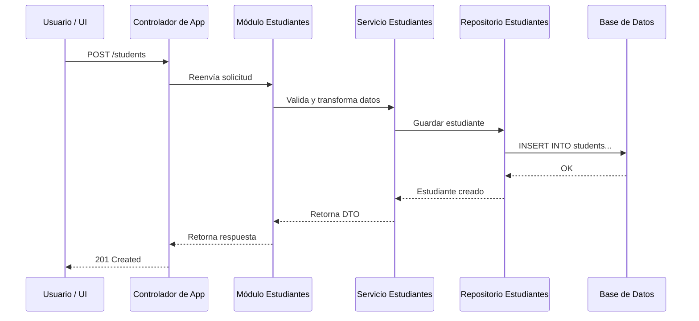
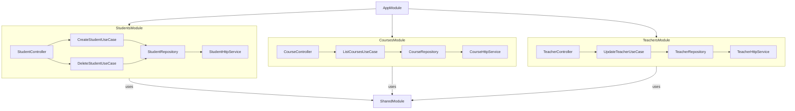

# Arquitectura modular monolítica

La **Arquitectura Modular Monolítica** es una forma de estructurar aplicaciones **grandes** dentro de un único despliegue (monolito), pero **dividida internamente en módulos independientes**, cada uno responsable de una parte del dominio. Es un punto intermedio entre un monolito tradicional (acoplado) y una arquitectura basada en microservicios.

## Características

|Característica|Descripción|
|--|--|
|Monolito|Se ejecuta y despliega como una sola unidad|
|Modular|La lógica está separada en módulos bien definidos|
|Bajo acoplamiento|Los módulos interactúan mediante interfaces o contratos|
|Alta cohesión|Cada módulo tiene control total sobre su lógica y sus datos|
|Facilidad para escalar|Permite extraer módulos a microservicios en el futuro|
|Útil para equipos pequeños|Reduce la complejidad de los despliegues múltiples|

## ¿Cuándo usarla?

- Cuando se quiere evitar la complejidad de los microservicios.
- En proyectos con varios dominios funcionales (ej. estudiantes, cursos, pagos).
- Para empezar con una base escalable desde el primer día.

## Ejemplo modular

Supongamos que estamos creando un sistema educativo con los módulos:

- `Students`
- `Courses`
- `Teachers`

En NestJS, al momento de organizar nuestro proyecto para tener una estructura modular haremos:

```txt
src/
├── main.ts
├── app.module.ts
├── modules/
│   ├── students/
│   │   ├── application/
│   │   ├── domain/
│   │   ├── infrastructure/
│   │   └── student.module.ts
│   ├── courses/
│   │   ├── application/
│   │   ├── domain/
│   │   ├── infrastructure/
│   │   └── course.module.ts
│   └── teachers/
│   │   ├── application/
│   │   ├── domain/
│   │   ├── infrastructure/
│   │   └── teacher.module.ts
```

En este caso los módulo se importan en `AppModule`. Si necesitan comunicarse, lo hacen mediante **interfaces** o **servicios exportados**, no accediendo directamente a clases internas.

Tomemos como ejemplo el módulo de estudiantes, la forma en que trabajará será la siguiente:



Cuando pasamos al frontend, podemos trabajar la organización modular de la siguiente manera:

```txt
src/app/
├── core/           → servicios globales (auth, logging)
├── shared/         → componentes reutilizables
├── features/
│   ├── students/
│   │   ├── domain/
│   │   ├── application/
│   │   ├── infrastructure/
│   │   └── ui/
│   ├── courses/
│   │   ├── domain/
│   │   ├── application/
│   │   ├── infrastructure/
│   │   └── ui/
│   └── teachers/
│   │   ├── domain/
│   │   ├── application/
│   │   ├── infrastructure/
│   │   └── ui/
```

Cada **"feature module"** tiene su propio dominio, lógica y presentación, siguiendo Clean Architecture internamente.



## Principios recomendados

|Principio|Aplicación|
|--|--|
|**Modularización**|Separación de responsabilidades por dominios funcionales|
|**Single Responsibility**|Cada módulo tiene una única razón para cambiar|
|**Open/Closed**|Los módulos pueden extenderse sin modificarse entre sí|
|**Bajo acoplamiento**|Comunicación a través de interfaces/exportaciones controladas|
|**Clean Architecture**|Cada módulo puede aplicar sus propias capas internas|

## Referencias

- Martin, R. C. (2018). Clean Architecture: A Craftsman's Guide to Software Structure and Design. Pearson.
- Khononov, M. (2021). Learning Domain-Driven Design: Aligning Software Architecture and Business Strategy. O’Reilly.
- [Modules - NestJS Documentation](https://docs.nestjs.com/modules)
- [Feature Modules - Angular Docs](https://angular.io/guide/feature-modules)
- Richardson, C. (2019). Microservices Patterns. Manning.
