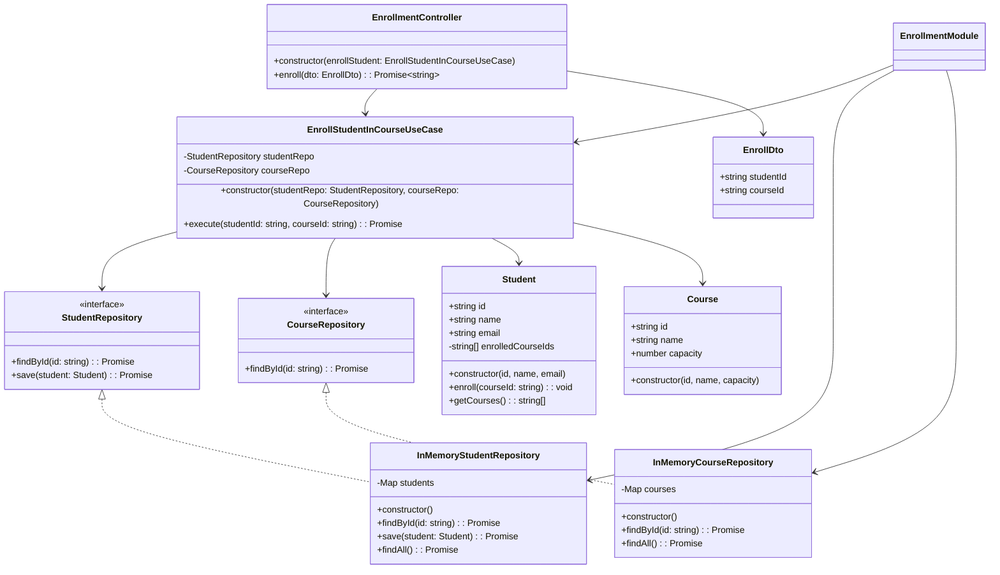
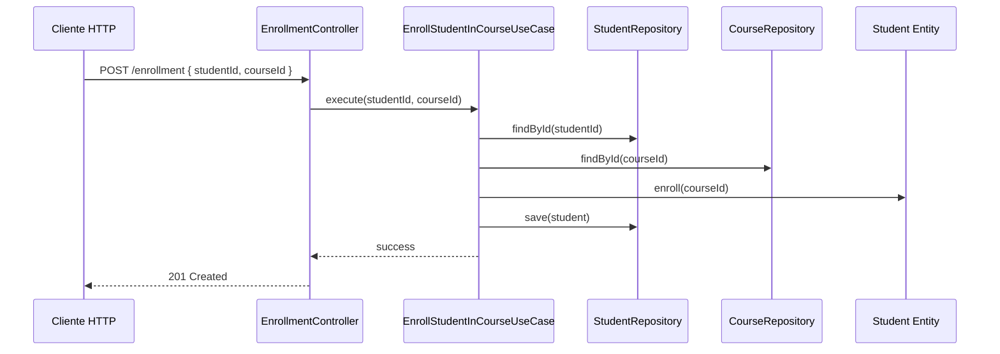

# Diseño de casos de uso y entidades

Una **entidad** representa un objeto del dominio que tiene **identidad propia** y que permanece consistente a lo largo del tiempo, incluso si sus atributos cambian. Ejemplo: Un estudiante con ID único, nombre y correo. Aunque cambie el correo, sigue siendo el mismo estudiante.

Un **caso de uso** representa una **acción** o **comportamiento del sistema** que produce valor para un actor (usuario o sistema externo). Define **lo que el sistema hace** en términos de negocio, sin preocuparse por cómo se implementa. Ejemplo: Registrar un estudiante, asignarlo a un curso, generar certificado, etc.

## Relación entre ambos

- Un **caso de uso** opera sobre **una o más entidades**.
- Las entidades contienen la lógica **inmutable** del dominio, mientras que los casos de uso representan la **interacción dinámica** con ese dominio.
- En Clean Architecture, los casos de uso viven en la capa `application`, y las entidades en la capa `domain`.

## Buenas prácticas

|Aspecto|Recomendación|
|--|--|
|Entidades|Evita poner lógica de infraestructura o frameworks|
|Casos de uso|Un solo propósito por clase (SRP)|
|Nombres|Usa verbos para casos de uso: `Create`, `List`, `Update`|
|Pruebas|Prueba casos de uso con mocks de repositorios|
|Contratos|Define interfaces (`ports`) para comunicarse entre capas|

## Ejemplo técnico en NestJS

Cuando un estudiante se inscribe en un curso, debemos:

- Verificar que el estudiantes existe
- Verificar que el curso existe
- Agregar el ID del curso a la lista de cursos del estudiante
- Guardar la inscripción

El scaffold del proyecto sería:

```txt
src/
├── domain/
│   ├── entities/
│   │   ├── student.entity.ts
│   │   └── course.entity.ts
│   ├── repositories/
│   │   ├── student.repository.ts
│   │   └── course.repository.ts
├── application/
│   └── use-cases/
│       └── enroll-student-in-course.usecase.ts
├── infrastructure/
│   └── db/
│       ├── student.repository.impl.ts
│       └── course.repository.impl.ts
├── modules/
│   └── enrollment/
│       ├── enrollment.module.ts
│       ├── enrollment.controller.ts
│       └── dto/
│           └── enroll.dto.ts
```



import Tabs from "@theme/Tabs";
import TabItem from "@theme/TabItem";

<Tabs>
<TabItem value="domain" label="Domain">

```ts title="src/domain/entities/student.entity.ts" showLineNumbers
export class Student {
  constructor(
    public readonly id: string,
    public name: string,
    public email: string,
    private enrolledCourseIds: string[] = []
  ) {}

  enroll(courseId: string) {
    if (!this.enrolledCourseIds.includes(courseId)) {
      this.enrolledCourseIds.push(courseId);
    }
  }

  getCourses() {
    return this.enrolledCourseIds;
  }
}
```

La clase `Student` es una entidad del dominio. Representa un estudiante del cual debe mantener sus propios datos (`id`, `name`, `email`, `enrolledCourses`), además de tener métodos que modifican su estado internamente. Es usada por el caso de uso y persistida mediante `StudentRepository`

```ts title="src/domain/entities/course.entity.ts" showLineNumbers
export class Course {
  constructor(
    public readonly id: string,
    public name: string,
    public capacity: number
  ) {}
}
```

Al igual que `Student`, la entidad `Course` se encarga de representar un curso con sus atributos y modelarlo para inscripción. Es usado por el caso de uso para validar si un curso existe antes de inscribir un estudiante en el mismo.

```ts title="src/domain/repositories/student.repository.ts" showLineNumbers
import { Student } from '../entities/student.entity';

export abstract class StudentRepository {
  abstract findById(id: string): Promise<Student | null>;
  abstract save(student: Student): Promise<void>;
}
```

`StudentRepository` es un contracto abstracto que define cómo acceder o modificar estudiantes, **sin implementar la lógica concreta**. Se encarga de definir métodos como interfaz para infraestructura. Es implementada por `InMemoryStudentRepository` y consumida por el caso de uso.

```ts title="src/domain/repositories/course.repository.ts" showLineNumbers
import { Course } from '../entities/course.entity';

export abstract class CourseRepository {
  abstract findById(id: string): Promise<Course | null>;
}
```

`CourseRepository` es un contracto abstracto que define cómo acceder a cursos.

</TabItem>
<TabItem value="app" label="Application">

```ts title="src/application/use-cases/enroll-student-in-course.usecase.ts" showLineNumbers
import { StudentRepository } from '../../domain/repositories/student.repository';
import { CourseRepository } from '../../domain/repositories/course.repository';

export class EnrollStudentInCourseUseCase {
  constructor(
    private readonly studentRepo: StudentRepository,
    private readonly courseRepo: CourseRepository
  ) {}

  async execute(studentId: string, courseId: string): Promise<void> {
    const student = await this.studentRepo.findById(studentId);
    if (!student) throw new Error('Student not found');

    const course = await this.courseRepo.findById(courseId);
    if (!course) throw new Error('Course not found');

    student.enroll(course.id);
    await this.studentRepo.save(student);
  }
}
```

El caso de uso `EnrollStudentInCourseUseCase` orquesta la lógica de negocio para inscribir un estudiante en un curso. Se encarga de verificar que estudiante y curso existen, invoca métodos de entidades, y persiste cambios usando el repositorio. Depende de los contratos abstractos, ya que opera sobre entidades del dominio, pero no sabe cómo se implementan los repositorios gracias al DIP (Principio de inversión de dependencias).

</TabItem>
<TabItem value="infra" label="Infrastructure">

```ts title="src/infrastructure/db/student.repository.impl.ts" showLineNumbers
import { StudentRepository } from '../../domain/repositories/student.repository';
import { Student } from '../../domain/entities/student.entity';
import { Injectable } from '@nestjs/common';

@Injectable()
export class InMemoryStudentRepository implements StudentRepository {
  private students: Map<string, Student> = new Map();

  constructor() {
    // Datos iniciales simulados
    const student = new Student('stu1', 'Alice', 'alice@email.com');
    this.students.set(student.id, student);
  }

  async findById(id: string): Promise<Student | null> {
    return this.students.get(id) || null;
  }

  async save(student: Student): Promise<void> {
    this.students.set(student.id, student);
  }

  // Método adicional para pruebas
  async findAll(): Promise<Student[]> {
    return Array.from(this.students.values());
  }
}
```

`InMemoryStudentRepository` es un adaptador concreto que implementa la interfaz `StudentRepository` usando solo memoria. Se encarga de simular una base de datos de estudiantes, ofrecer persistencia temporal para pruebas o prototipos.

```ts title="src/infrastructure/db/course.repository.impl.ts" showLineNumbers
import { CourseRepository } from '../../domain/repositories/course.repository';
import { Course } from '../../domain/entities/course.entity';
import { Injectable } from '@nestjs/common';

@Injectable()
export class InMemoryCourseRepository implements CourseRepository {
  private courses: Map<string, Course> = new Map();

  constructor() {
    // Curso simulado
    const course = new Course('course1', 'Clean Architecture', 25);
    this.courses.set(course.id, course);
  }

  async findById(id: string): Promise<Course | null> {
    return this.courses.get(id) || null;
  }

  // Método adicional para pruebas
  async findAll(): Promise<Course[]> {
    return Array.from(this.courses.values());
  }
}
```

`InMemoryCourseRepository` es un adaptador concreto que implementa la interfaz `CourseRepository`. Provee una lista de cursos simulada y otras funcionalidades relacionadas a los cursos.

</TabItem>
<TabItem value="controller" label="Controller">

```ts title="src/modules/enrollment/enrollment.controller.ts" showLineNumbers
import { Controller, Post, Body, HttpCode, HttpException, HttpStatus } from '@nestjs/common';
import { EnrollStudentInCourseUseCase } from 'src/application/use-cases/enroll-student-in-course.usecase';
import { EnrollDto } from './dto/enroll.dto';

@Controller('enrollment')
export class EnrollmentController {
  constructor(private readonly enrollStudent: EnrollStudentInCourseUseCase) {}

  @Post()
  @HttpCode(201)
  async enroll(@Body() dto: EnrollDto): Promise<{ message: string }> {
    try {
      await this.enrollStudent.execute(dto.studentId, dto.courseId);
      return { message: 'Estudiante inscrito exitosamente' };
    } catch (error) {
      throw new HttpException(
        { message: error.message },
        HttpStatus.BAD_REQUEST,
      );
    }
  }
}
```

```ts title="src/modules/enrollment/dto/enroll.dto.ts" showLineNumbers
import { IsString, IsUUID } from 'class-validator';

export class EnrollDto {
  @IsString()
  studentId: string;

  @IsString()
  courseId: string;
}
```

</TabItem>
<TabItem value="module" label="EnrollmentModule">

```ts title="src/modules/enrollment/enrollment.module.ts" showLineNumbers
import { Module } from '@nestjs/common';
import { EnrollStudentInCourseUseCase } from 'src/application/use-cases/enroll-student-in-course.usecase';
import { StudentRepository } from 'src/domain/repositories/student.repository';
import { CourseRepository } from 'src/domain/repositories/course.repository';
import { InMemoryStudentRepository } from 'src/infrastructure/db/student.repository.impl';
import { InMemoryCourseRepository } from 'src/infrastructure/db/course.repository.impl';
import { EnrollmentController } from './enrollment.controller';

@Module({
  controllers: [EnrollmentController],
  providers: [
    EnrollStudentInCourseUseCase,
    { provide: StudentRepository, useClass: InMemoryStudentRepository },
    { provide: CourseRepository, useClass: InMemoryCourseRepository },
  ],
})
export class EnrollmentModule {}
```

`EnrollmentModule` es un módulo NestJS, y **orquesta las dependencias** necesarias para el caso de uso `EnrollStudentInCourse`. Se encarga de registrar el caso de uso cómo un provider, de asociar interfaces con implementaciones, y también registrar el controlador REST. Es el punto de entrada para el principio IoC (Inversión de control), y expone el caso de uso para ser consumido por un controlador o por otros módulos.

</TabItem>
</Tabs>



## Referencias

- Martin, R. C. (2018). Clean Architecture: A Craftsman's Guide to Software Structure and Design. Pearson.
- Evans, E. (2003). Domain-Driven Design: Tackling Complexity in the Heart of Software. Addison-Wesley.
- Khononov, V. (2021). Learning Domain-Driven Design. O'Reilly.
- [Angular Team. (2024). Architecture Overview.](https://angular.io/guide/architecture)
- [NestJS Docs. (2024). Providers & Modules.](https://docs.nestjs.com)
