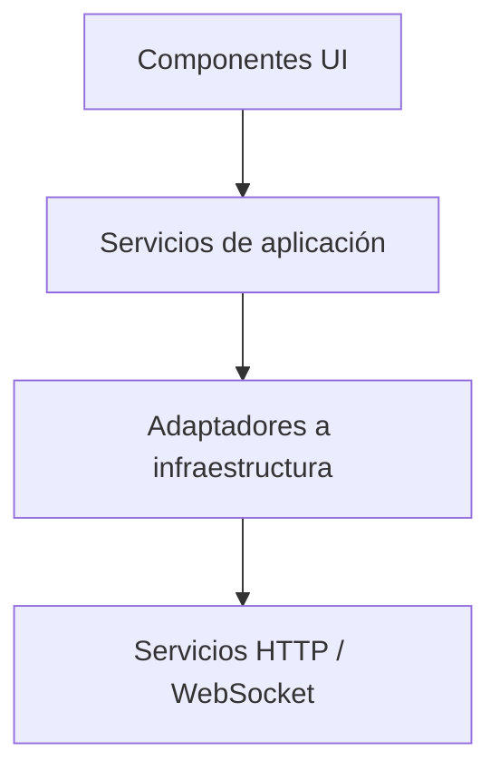

# ¿Qué es Angular y por qué usarlo?

**Angular** es un **framework de desarrollo web de código abierto**, mantenido por Google, diseñado para construir **aplicaciones web modernas, escalables y de alto rendimiento**. Se basa en **TypeScript**, un superconjunto de JavaScript tipado, y ofrece una solución integral que abarca desde la gestión del estado hasta el renderizado de vistas, la navegación entre rutas y la integración con APIs.

Desde su reescritura completa en 2016 (Angular 2+), Angular se posicionó como un framework de **arquitectura completa (opinionated)**, a diferencia de bibliotecas como React o Vue que son más minimalistas y requieren integración con herramientas externas.

## Características clave de Angular

1. **Basado en componentes (Component-Based Architecture)**

   Angular se estructura en torno a componentes independientes, reutilizables y encapsulados. Cada componente gestiona una parte específica del DOM y contiene su propia lógica, estilos y plantilla.

2. **Soporte completo para desarrollo empresarial**

   Angular viene con un ecosistema rico que incluye:

   - Enrutamiento (Router) con lazy-loading.
   - Formularios tanto reactivos como template-driven.
   - Inyección de dependencias (DI).
   - Internacionalización (i18n).
   - Herramientas CLI para scaffolding, testing y build.
   - Angular Material y CDK (Component Dev Kit) para construir interfaces modernas y accesibles.

3. **TypeScript y tipado fuerte**

   Angular exige el uso de TypeScript, lo cual permite:

   - Validaciones en tiempo de compilación.
   - Refactorización segura.
   - Mejora de la productividad en equipos grandes.
   - IDEs más potentes (auto completado, navegación de código, etc).

4. **Clean Architecture modular**

   Angular promueve la separación por responsabilidades mediante el uso de:

   - Módulos funcionales (feature modules)
   - Módulos compartidos (shared modules)
   - Standalone components (desde Angular 14, consolidado en Angular 17+ y 20)

5. **Reactividad y rendimiento**

   Con el soporte de signals (Angular 16+), Angular dio un paso importante hacia la reactividad explícita, similar a otros frameworks modernos como SolidJS. Esta nueva API permite una gestión de estados más eficiente y predecible.

## ¿Por qué usar Angular?

1. **Todo en uno para proyectos complejos**

   Angular es una solución "baterías incluidas": no necesitas decidir qué librería usar para cada aspecto del desarrollo. Esto es especialmente útil en contextos empresariales, donde se valora la consistencia tecnológica y mantenibilidad.

2. **Soporte para grandes equipos**

   Gracias a su estructura modular, tipado estricto y convenciones claras, Angular facilita el trabajo en equipos grandes y distribuidos, permitiendo que múltiples desarrolladores colaboren sin interferencias.

3. **Seguridad y escalabilidad**

   Angular proporciona protecciones por defecto contra vulnerabilidades comunes (XSS, CSRF), además de patrones bien establecidos para construir aplicaciones escalables y mantenibles en el tiempo.

4. **Testing listo para producción**

   Angular incluye herramientas para realizar pruebas:

   - Unitarias (con Karma o Jest)
   - De integración (con TestBed y HttpTestingController)
   - E2E (con Playwright, Cypress o herramientas integradas en Angular CLI)

5. **Soporte educativo y comunitario**

   Angular es ampliamente adoptado en la industria, por lo que existen numerosos recursos, documentación oficial, cursos y comunidades activas.

## Evolución y versiones recientes

Angular ha evolucionado significativamente. En las versiones recientes:

|Versión|Característica destacada|
|--|--|
|14|Standalone Components (beta)|
|15|Standalone API estable|
|16|Signals API introducida|
|17|Control Flow (`@if`, `@for`)|
|18|Optional zone.js, mejor lazy loading|
|20|Signals refinados, CLI mejorado, optimización de SSR y mejoras en DX|

Desde Angular 17, el framework se aproxima a un enfoque más funcional, reactivo y moderno, eliminando gran parte del "boilerplate" innecesario que solía caracterizarlo.

## Relación con Clean Architecture

Angular permite estructurar la aplicación en capas similares a Clean Architecture:

- Componentes: Interfaz de usuario.
- Servicios de aplicación: Lógica de presentación y casos de uso.
- Repositorios: Llamadas a APIs externas (infraestructura).
- Dominio: Puede modelarse como servicios o entidades puras (si se desea).

## Conclusión

Angular es un **framework maduro, poderoso y productivo** para aplicaciones empresariales de gran escala. Su fuerte énfasis en la arquitectura, el tipado estático y las herramientas integradas lo hacen ideal para escenarios donde la mantenibilidad, escalabilidad y seguridad son prioridad. Aunque **tiene una curva de aprendizaje más pronunciada que otros frameworks**, su estructura clara y sus herramientas bien integradas justifican su elección en contextos profesionales.

## Referencias

- Angular Team. (2024). [Angular Docs (v17+ & v20)](https://angular.dev). Google LLC.
- Angular Team. (2023). [Angular v17: Standalone components and control flow](https://blog.angular.io/angular-v17-why-it-matters-129e5a50c4c2). Medium.
- Gajic, D. (2024). [Mastering Angular 20: Building Enterprise Applications with Clean Architecture](https://leanpub.com/mastering-angular20). Leanpub.
- Microsoft. (2023). [TypeScript: Documentation.](https://www.typescriptlang.org/docs/)
- Google Developers. (2024). [Why choose Angular for enterprise apps.](https://web.dev/angular)
- Posva, E. (2022). [Comparing frameworks: Angular vs React vs Vue](https://www.smashingmagazine.com/2022/11/angular-react-vue-comparison/). Smashing Magazine.
- Sander Elias et al. (2023). [Angular 16+: Signals, Better Zone-less Apps, and Next-gen Rendering](https://blog.angular.io/angular-v16-is-here-4d7a28ec680d). Angular Team, Google.
- Toptal. (2023). [What is Angular Used For?.](https://www.toptal.com/angular/angular)
- Stack Overflow. (2023). [Developer Survey: Framework Usage.](https://survey.stackoverflow.co/2023/#section-most-popular-technologies)
