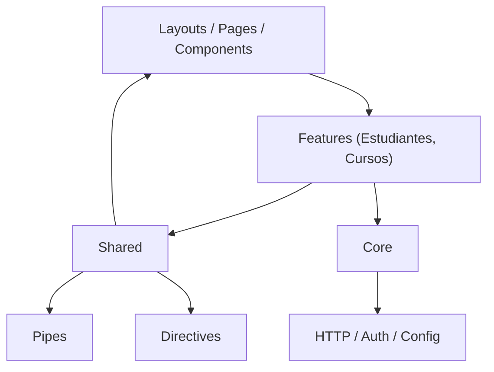

# Estructura de un proyecto Angular

Una buena estructura en Angular:

- Facilita el **mantenimiento** y la **escalabilidad**
- Mejora la colaboración entre equipos
- Alinea el código con principios de **Clean Architecture** y **modularidad**
- Permite que el **routing**, **lazy loading** y **SSR** funcionen de forma más eficiente

Angular permite libertad estructural, pero existen **convenciones ampliamente adoptadas** que promueven la calidad y organización del código.

## Estructura generada por defecto

Cuando ejecutas:

```bash
ng new frontend --standalone --routing --style=scss
```

Angular genera una estructura base:

```bash
frontend/
├── src/
│   ├── app/
│   │   ├── app.config.server.ts
│   │   ├── app.config.ts
│   │   ├── app.html
│   │   ├── app.routes.server.ts
│   │   ├── app.routes.ts
│   │   ├── app.scss
│   │   ├── app.spec.ts
│   │   └── app.ts
│   ├── index.html
│   ├── main.server.ts
│   ├── main.ts
│   ├── server.ts
│   └── styles.scss
├── .editorconfig
├── .gitignore
├── angular.json
├── package.json
└── tsconfig.app.json
└── tsconfig.json
└── tsconfig.spec.json
```

- `.editorconfig`: Archivo de configuración de estilo de código compartido entre editores (indentación, fin de línea, codificación). Mejora la coherencia del equipo.
- `.gitignore`: Lista de archivos y carpetas que Git no debe rastrear, como `node_modules`, builds temporales, o configuraciones locales.
- `angular.json`: Archivo de configuración principal del Angular CLI:
  - Define proyectos (app, server)
  - Scripts y estilos globales
  - Entradas como main.ts y index.html
  - Configuración de SSR
  - Builder: Vite o Webpack
  - Arquitectura del workspace
- `package.json`: Contiene:
  - Dependencias (`@angular/core`, `rxjs`, etc.)
  - Scripts (`ng serve`, `ng build`, `dev:ssr`)
  - Metainformación del proyecto (nombre, versión)
  - DevDependencies y scripts de pruebas
- `tsconfig.json`: Configuración general del compilador TypeScript (versiones, reglas de tipado, includes). Es extendido por otros archivos `tsconfig.*.json`.
- `tsconfig.app.json`: Extiende de `tsconfig.json`. Configura el **proyecto principal de aplicación** (excluye tests y servidor).
- `tsconfig.spec.json`: Configuración de TypeScript para los archivos `.spec.ts` (tests). Define `types`, `includes`, y configuraciones específicas de pruebas.
- `main.ts`: Punto de entrada del navegador. Hace bootstrap de la app:
  
  ```ts
  bootstrapApplication(AppComponent, appConfig)
  ```

  Usa `app.config.ts` y el componente raíz (`AppComponent` o `App` standalone).
- `main.server.ts`: Punto de entrada del renderizado en servidor. Ejecuta bootstrapApplication en modo SSR. Equivale a `main.ts`, pero para Node.js.
- `server.ts`: Archivo que levanta el servidor Express que hace SSR usando Angular Universal. Angular compila tus componentes en el backend y genera HTML desde el servidor para mejorar el SEO y el rendimiento inicial.
- `styles.scss`: Archivo de estilos globales para toda la app. Aquí puedes configurar Tailwind, Bootstrap, fuentes, colores, etc.
- `app.ts`: Componente raíz standalone (`@Component`) que reemplaza el tradicional `AppComponent`.
  
  ```ts showLineNumbers
  @Component({
    standalone: true,
    selector: 'app-root',
    templateUrl: 'app.html',
    styleUrls: ['app.scss'],
    imports: [RouterOutlet],
  })
  export class App { ... }
  ```

  Es la raíz visual de la app, definida en `index.html`.
- `app.html`: Plantilla HTML asociada a App (como antes era app.component.html).
  
  ```html
  <router-outlet />
  ```

  Puede incluir headers, layouts o simplemente enrutar a otros módulos.
- `app.scss`: Archivo SCSS de estilos propios del componente App.
- `app.spec.ts`: Archivo de test unitario para el componente App. Usa `@angular/testing` y `jest` o `karma` para testear el DOM o funcionalidad.
- `app.config.ts`: Archivo donde se configura el **bootstrap de la app en el navegador**.

  Ejemplo:

  ```ts showLineNumbers
  export const appConfig: ApplicationConfig = {
    providers: [
      provideBrowserGlobalErrorListeners(),
      provideZonelessChangeDetection(),
      provideRouter(routes), provideClientHydration(withEventReplay())
    ]
  };
  ```

  Se usa en main.ts para inicializar los providers y rutas.
- `app.config.server.ts`: Archivo opcional que permite configurar **providers diferentes para el entorno SSR** (por ejemplo, solo en el backend). Se usa en main.server.ts
- `app.routes.ts`: Contiene la configuración de rutas de la aplicación (navegación en navegador).
  
  ```ts
  export const APP_ROUTES: Route[] = [
    { path: '', component: HomePage },
    { path: 'students', loadComponent: () => import(...) }
  ];
  ```

  Usado en app.config.ts.
- `app.routes.server.ts`: Contiene rutas específicas para el entorno **SSR o prerendering**. Puedes excluir rutas dinámicas o aplicar guards distintos.

## Estructura recomendad para proyectos escalables

Una estructura modular y limpia en Angular 20 con standalone components podría verse así:

```bash
src/
├── app/
│   ├── core/                 # Servicios de dominio global (singleton)
│   ├── shared/               # Componentes reusables, pipes, directivas
│   ├── features/             # Módulos de dominio funcional
│   │   ├── students/
│   │   │   ├── pages/
│   │   │   ├── components/
│   │   │   ├── services/
│   │   │   └── student.routes.ts
│   │   └── courses/
│   ├── layouts/              # Layouts como MainLayout, AdminLayout
│   ├── app.config.ts         # Configuración de bootstrap
│   ├── app.routes.ts         # Definición del router principal
│   └── app.component.ts
├── assets/                   # Archivos estáticos
├── environments/             # Variables por entorno
└── main.ts                   # Bootstrap principal
```

### `core/`

Contiene servicios globales singleton, accesibles en toda la aplicación:

- `auth.service.ts`
- `logger.service.ts`
- `http-interceptor.ts`
- `config.service.ts`

Se recomienda que los servicios en `core/` no tengan dependencias con `features/`.

### `shared/`

Contiene código reutilizable entre módulos funcionales:

- `ButtonComponent`
- `InputComponent`
- `DatePipe`
- `AuthDirective`

No contiene lógica de negocio. Solo UI, validaciones, formatos, etc.

### `features/`

Cada carpeta representa un **módulo funcional independiente**, siguiendo el principio de **modularidad vertical**.

Ejemplo: **students/**

```bash
students/
├── pages/
│   └── list-students.component.ts
├── components/
│   └── student-card.component.ts
├── services/
│   └── student-api.service.ts
├── student.routes.ts
└── index.ts
```

Cada feature es completamente autónomo, ideal para **lazy loading**.

### `layouts/`

Contiene los componentes de layout usados como contenedores:

- `MainLayoutComponent`
- `AdminLayoutComponent`

Manejan menús, encabezados, footers, etc.

### `app.routes.ts`

Archivo central que define las rutas de primer nivel, por ejemplo:

```ts title="app.routes.ts" showLineNumbers
export const appRoutes: Routes = [
  {
    path: '',
    component: MainLayoutComponent,
    children: [
      {
        path: 'students',
        loadChildren: () => import('./features/students/student.routes')
          .then(m => m.STUDENT_ROUTES),
      },
    ],
  }
];
```

Ideal para lazy loading estructurado con standalone components.

## Estructura para testing

Cada archivo `.ts` suele tener su contraparte `.spec.ts`:

```bash
student-card.component.ts
student-card.component.spec.ts
```

Usualmente se organizan en el mismo directorio que el componente original, para mejor cohesión y mantenibilidad.

## Relación entre capas



## Relación con Clean Architecture

Angular puede simular una Clean Architecture adaptada al frontend:

|Capa Clean|Ubicación Angular|
|--|--|
|UI|`components/`, `pages/`|
|Application|`services/` (llaman a APIs)|
|Domain (si aplica)|`models/`, `interfaces/`|
|Infrastructure|`api/`, `adapters/`|

## Conceptos Angular y adaptaciones modernas

|Concepto Angular tradicional|Alternativa moderna Angular 20|
|--|--|
|NgModules|Standalone Components|
|NgIf/NgFor|`@if`, `@for`|
|`ngOnInit`|`effect()`, `signal()`|
|Routing en `AppModule`|Routing en `app.routes.ts`|
|Global Providers|`provideX()` en `app.config.ts`|

## Referencias

- Angular Team. (2024). [Application Structure Guide](https://angular.dev/guide/project-structure).
- Gajic, D. (2024). [Mastering Angular 20 with Clean Architecture.](https://leanpub.com/mastering-angular20)
- Angular Team. (2023). [Standalone APIs & Routing.](https://angular.dev/guide/standalone-components)
- Angular Team. (2023). [Signals, zoneless, and optimized rendering.](https://blog.angular.io/angular-v17)
