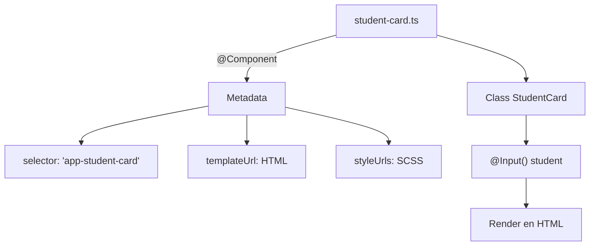

# ¿Qué es un componente? (decoradores, selector, HTML, CSS, TS)

Un **componente en Angular** es una **unidad fundamental de la interfaz de usuario**. Representa una porción autocontenida de la vista (UI) y encapsula su estructura, estilo y lógica de comportamiento.

Está compuesto por:

- Un archivo HTML que define la estructura visual
- Un archivo CSS/SCSS con sus estilos
- Un archivo TypeScript (TS) con la lógica
- Un decorador `@Component()` que configura su metadata

Cada componente está vinculado a un **selector**, que puede usarse como una etiqueta personalizada en otras partes del HTML.

## ¿Qué hace único a un componente?

Un componente de Angular:

- Puede ser **reutilizable**, **encapsulado** y **testable**
- Tiene un **ciclo de vida controlado** (`ngOnInit`, `ngOnDestroy`, etc.)
- Se conecta a otros componentes mediante:
  - Inputs (`@Input`)
  - Outputs (`@Output`)
  - Servicios (con `inject()` o constructor)
- Puede participar en **ruteo**, formularios, comunicación o SSR

## Estructura de un componente (Angular 20)

```ts title="student-card.ts" showLineNumbers
import { Component, Input } from '@angular/core';
import { CommonModule } from '@angular/common';
import { Student } from '../models/student.model';

@Component({
  selector: 'app-student-card',
  standalone: true,
  imports: [CommonModule],
  templateUrl: './student-card.html',
  styleUrls: ['./student-card.scss'],
})
export class StudentCard{
  @Input() student!: Student;
}
```



### Decorador `@Component()`

El decorador es una función que define la metadata del componente:

|Propiedad|Función|
|--|--|
|`selector`|Nombre de la etiqueta personalizada en HTML|
|`templateUrl`|Ruta al archivo HTML del componente|
|`styleUrls`|Ruta al archivo SCSS/CSS|
|`imports`|Módulos o componentes que este componente puede usar|
|`standalone`|(Desde Angular 14) indica que **no depende de un NgModule**|

En **Angular 20**, casi todos los componentes nuevos son **standalone por defecto**.

### HTML Template

```html title="student-card.html"
<div class="card">
  <h2>{{ student.fullName }}</h2>
  <p>Email: {{ student.email }}</p>
</div>
```

Aquí se usan expresiones interpoladas (`{{ }}`) para mostrar los datos del student pasado como input.

### Styles Template

```css
.card {
  padding: 1rem;
  border: 1px solid #ccc;
  border-radius: 8px;
  font-family: Arial;
}
```

Los estilos están **encapsulados** al componente, lo que evita conflictos globales.

### TypeScript

El archivo `student-card.ts` contiene la clase lógica del componente. Es donde declaras propiedades, métodos, lógica de presentación, bindings, etc.

## Ejemplo de uso de componente

Si el selector es `app-student-card`, puedes usarlo así en otro componente:

```html
<app-student-card [student]="selectedStudent"></app-student-card>
```

Donde `selectedStudent` es una variable de tipo `Student` en el componente padre.

## Buenas prácticas en componentes

- **Responsabilidad única:** un componente debe hacer una sola cosa (Single Responsibility)
- Usa `standalone: true` siempre que sea posible
- Divide componentes grandes en componentes hijos reutilizables
- No mezcles lógica de negocio compleja en el componente, mejor usa servicios
- Nombra los archivos y selectores con prefijos (app-, admin-, user-)
- Siempre tipa tus `@Input()` y usa interfaces para datos

## Relación con SOLID

|Principio|Aplicación en componentes Angular|
|--|--|
|SRP|Un componente, una responsabilidad visual o lógica|
|OCP|Puedes extender la funcionalidad con nuevos componentes hijos|
|DIP|El componente no crea datos, los recibe (inyección de dependencias|
|LSP|Puedes sustituir componentes hijos con otros equivalentes|

## Referencias

- Angular Team. (2024). [Component Authoring Guide.](https://angular.dev/guide/component-overview)
- Google Developers. (2023). [Standalone Components in Angular.](https://blog.angular.io/standalone-components-in-angular-14-70444c6c2f0f)
- Freeman, E. & Robson, E. (2020). Head First Design Patterns. O’Reilly.
- Brown, S. (2023). [Angular Clean Architecture](https://leanpub.com/clean-angular-architecture). Leanpub.
