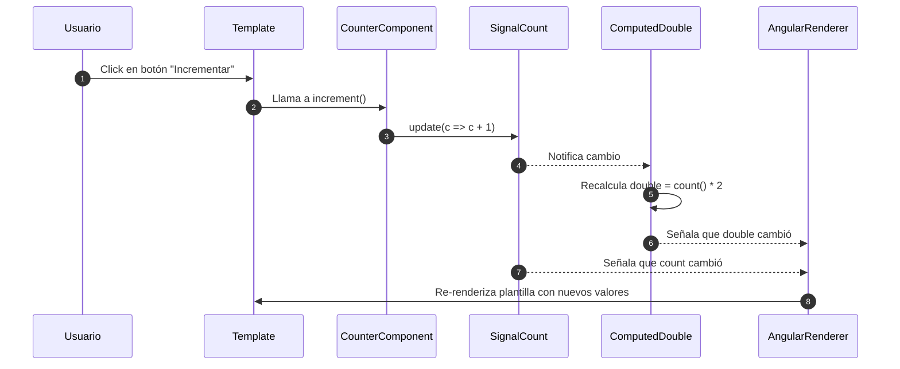

# Signals

Los **Signals** son una **nueva forma de manejar reactividad** introducida en Angular 16, diseñada para reemplazar o complementar a mecanismos como `RxJS`, `@Input()`, `@Output()` y `ChangeDetection`, pero con un enfoque **declarativo, sincrónico y predictible**.

Un **Signal** representa un **valor reactivo** que puede:

- Ser leído (`signal()`)
- Ser modificado (`set`, `update`)
- Ser observado por otros Signals, `computed()` o `effect()`

Es similar a un `BehaviorSubject` de RxJS, pero más simple, más rápido y sin necesidad de suscripciones ni pipes.

## ¿Por qué usar Signals?

|Ventaja clave|Descripción|
|--|--|
|Simplicidad|No requiere suscripciones, observables ni pipes (`.subscribe()` o `.pipe()`)|
|Performance|Detecta solo los cambios necesarios, sin necesidad de `Zone.js`|
|Declarativo|Permite modelar dependencias de forma transparente con `computed()` y `effect()`|
|Integración|Funciona perfectamente con inputs, stores, templates y lifecycle hooks|

## ¿Cómo funciona?

```ts showLineNumbers
import { signal } from '@angular/core';

const count = signal(0);        // signal<number>
count();                        // obtener el valor: 0
count.set(5);                   // asignar un nuevo valor
count.update(v => v + 1);       // modificar basándose en el valor anterior
```

## Tipos de Signals

### Signals Base `signal()`

```ts
const name = signal('Carlos');
name();         // => "Carlos"
name.set('Ana'); // actualiza
```

### Signals Computados `computed()`

Se actualiza automáticamente cuando sus dependencias cambian.

```ts
const fullName = computed(() => `${firstName()} ${lastName()}`);
```

### Efectos `effect()`

Se ejecuta cada vez que cambia un Signal del que depende.

```ts
effect(() => {
  console.log('El contador cambió a:', count());
});
```

## Ejemplo práctico

Hagamos un contador simple:

```ts title="counter.ts" showLineNumbers
import { Component, signal, computed } from '@angular/core';

@Component({
  selector: 'app-counter',
  standalone: true,
  template: `
    <p>Contador: {{ count() }}</p>
    <p>Doble: {{ double() }}</p>
    <button (click)="increment()">Incrementar</button>
  `
})
export class CounterComponent {
  count = signal(0);
  double = computed(() => this.count() * 2);

  increment() {
    this.count.update(c => c + 1);
  }
}
```

- `count` es un signal base
- `double` es un signal computado
- Angular actualiza la UI automáticamente cuando cambian los valores.



1. El usuario hace clic en el botón del componente.
2. El método `increment()` es ejecutado
3. Se actualiza el signal `count`.
4. El signal `count` propaga el cambio hacia todos los observers, incluyendo el `computed() double`.
5. El valor de `double` se recalcula automáticamente.
6. Angular detecta que hay cambios en `double()`.
7. Angular detecta que hay cambios en `count()`.
8. Se actualiza solo las partes necesarias del DOM.

## Reglas de uso

- Los signals **se acceden como funciones**: `count()` y no `count`.
- No son observables, pero son reactivamente conectables a `RxJS` si se necesita.
- Los templates observan signals de forma automática y eficiente.

## Aplicaciones prácticas

|Caso de uso|Cómo ayuda Signals|
|--|--|
|Componentes Standalone|Sin necesidad de servicios complejos|
|Stores reactivos|Reemplazan `BehaviorSubject`|
|Inputs y outputs modernos|Con `input()` y `output()`|
|SSR y SSG|Reactividad sin Zone.js|
|Formularios personalizados|Control fino de estado|
|Actualización de vista optimizada|Angular solo renderiza lo necesario|

## Referencias (APA 7)

- Angular Team. (2023). [Signals Overview](https://angular.dev/guide/signals). Angular.dev.
- Angular Team. (2023). [Signals API](https://angular.dev/api/core/signal). Angular.dev.
- Netanel Basal. (2023). [Angular Signals Deep Dive](https://netbasal.com).
- Brown, S. (2024). Clean Angular Architecture. Leanpub.
