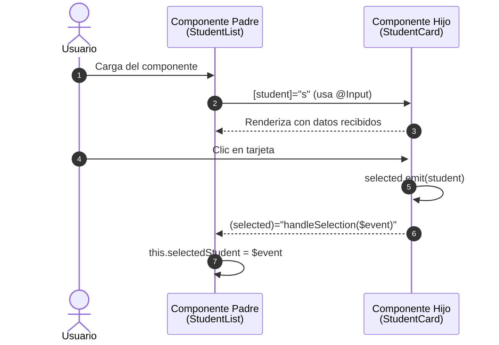

# Comunicación entre componentes: `@Input` y `@Output`

En Angular, las aplicaciones se construyen como árboles de componentes, donde:

- **Componentes padres** contienen a componentes hijos
- Se requiere **compartir datos del padre al hijo** (ej: propiedades)
- O el **hijo debe notificar eventos al padre** (ej: clic, selección)

Para ello, Angular ofrece dos mecanismos principales:

- `@Input()`: Comunicación de padre a hijo (datos)
- `@Output()`: Comunicación de hijo a padre (eventos)

Esto favorece un diseño desacoplado, escalable y testeable.

## `@Input()`

El decorador `@Input()` indica que una propiedad del componente puede recibir un valor desde su componente padre.

Por ejemplo, tenemos una tarjeta de estudiante que debe recibir los datos del estudiante desde un componente padre:

```ts title="student-card.ts" showLineNumbers
import { Component, Input } from '@angular/core';
import { Student } from '../models/student';

@Component({
  selector: 'app-student-card',
  standalone: true,
  templateUrl: './student-card.html',
})
export class StudentCard {
  @Input({ required: true }) student!: Student;
}
```

El `!` indica que el valor será inicializado por Angular. Desde Angular 16+ puedes usar `{ required: true }` para validación más estricta.

La lista de estudiantes, quien actúa como componente padre envía la información del estudiante a la tarjeta:

```html title="student-list.html" showLineNumbers
<app-student-card 
  *ngFor="let s of students" 
  [student]="s">
</app-student-card>
```

El valor de la propiedad `student` se pasa a cada componente hijo.

## `@Output()`

El decorador `@Output()` declara una propiedad que emite un evento personalizado (con `EventEmitter`) al componente padre.

Por ejemplo, el componente hijo debe reportar al padre el estudiante seleccionado:

```ts title="student-card.ts" showLineNumbers
import { Component, Input, Output, EventEmitter } from '@angular/core';
import { Student } from '../models/student';

@Component({
  selector: 'app-student-card',
  standalone: true,
  templateUrl: './student-card.html',
})
export class StudentCard {
  @Input() student!: Student;
  @Output() selected = new EventEmitter<Student>();

  selectStudent() {
    this.selected.emit(this.student);
  }
}
```

```html title="student-card.html" showLineNumbers
<div class="card" (click)="selectStudent()">
  <h3>{{ student.fullName }}</h3>
</div>
```

Por su lado, el componente padre debe recibirlo y hacer algún tratamiento con el dato emitido:

```html title="student-list.html" showLineNumbers
<app-student-card 
  *ngFor="let s of students" 
  [student]="s" 
  (selected)="handleSelection($event)">
</app-student-card>
```

```ts title="student-list.ts" showLineNumbers
handleSelection(student: Student) {
  this.selectedStudent = student;
}
```

## Diagrama de Secuencia



1. El usuario inicia la carga del componente padre `StudentList`.
2. Este itera y pasa datos a los componentes hijos `StudentCard` mediante la propiedad `@Input() student`.
3. El componente hijo se renderiza con esos datos.
4. El usuario hace clic en una tarjeta.
5. El hijo emite un evento con `@Output() selected.emit(student)`.
6. El componente padre escucha ese evento con `(selected)="handleSelection($event)"`.
7. El padre actualiza su estado interno (`selectedStudent` o similar).

## Cambios en versiones más recientes

Con la llegada de Angular 16 y su consolidación en Angular 20, se introduce una nueva forma de trabajar con **comunicación entre componentes** que prioriza la **reactividad explícita**, **la eliminación de** `Zone.js` y el uso de **signals**. Esto representa un cambio paradigmático frente al enfoque tradicional basado en decoradores como `@Input()` y `@Output()`.

### Vision general de ambos enfoques

|Característica|`@Input()` / `@Output()` (Clásico)|`input()` / `output()` (Moderno)|
|--|--|--|
|Paradigma|Imperativo / Declarativo parcial|Completamente declarativo y reactivo|
|Decoradores|`@Input()`, `@Output()`|`input()` y `output()` desde `@angular/core`|
|Reactividad|Manual (requiere `ngOnChanges()` para detectar)|Reactiva por naturaleza (Signal tracking automático)|
|Mutabilidad|Mutables (acceso directo al campo)|Inmutables por diseño (`readonly`, acceso controlado)|
|Zona de cambios (Zone.js)|Requiere Zone.js para detección de cambios|No necesita Zone.js (ideal para apps "zoneless")|
|Legibilidad y trazabilidad|Menor claridad en flujos de actualización|Alto control y trazabilidad reactiva (`effect`, `computed`)|
|Aplicabilidad en SSR / SSG|Posible, pero propensa a errores|Mejor soporte con estado reactivo y desacoplado|

### Entrada de datos: `@Input()` vs `input()`

1. Forma clásica: `@Input()`

   ```ts
   @Input() student!: Student;
   ```

   - Permite recibir valores desde el componente padre.
   - No es reactivo. Para reaccionar a cambios se necesita `ngOnChanges()`.
   - Usado directamente en la plantilla: `{{ student.name }}`
   - Difícil de componer y testear.
   - Cambios no rastreados automáticamente.

2. Forma moderna: `input(): InputSignal<T>`

    ```ts
    readonly student = input.required<Student>();
    ```

   - Se accede como un signal: `student()`
   - Es completamente reactivo: usable en `computed()`, `effect()`, etc.
   - No necesita lifecycle hooks.

   Por ejemplo:

   ```ts
   readonly student = input.required<Student>();
   readonly fullName = computed(() => `${this.student().first} ${this.student().last}`);
   ```

   Sus ventajas:

   - Más declarativo y testable.
   - Integrado con el ecosistema de signals.
   - Compatible con aplicaciones sin Zone.js.
   - Se puede validar como requerido desde el decorador.

### Salida de datos: `@Output()` vs `output()`

1. Forma clásica: `@Output()`

   ```ts
   import { Output, EventEmitter } from '@angular/core';
   @Component({ selector: 'my-comp', template: `<button (click)="doIt()">Click</button>` })
   export class MyComp {
     @Output() clicked = new EventEmitter<void>();
     doIt() { this.clicked.emit(); }
   }
   ```

   - Usa `EventEmitter`, que:
     - Extiende `Subject` de RxJS.
     - Tiene `.emit(`), `.subscribe()` y `.pipe()` (RxJS operators).
   - Compatible con template binding:

     ```html
     <my-comp (clicked)="onClick()"></my-comp>
     ```

2. Forma moderna: `output(): OutputEmitterRef`

   ```ts
   import { output, OutputEmitterRef } from '@angular/core';

   @Component({ 
      standalone: true, 
      selector: 'my-comp', 
      template: `<button (click)="doIt()">Click</button>` 
   })
   export class MyComp {
     clicked: OutputEmitterRef<void> = output();
     doIt() { this.clicked.emit(); }
   }
   ```

   - `output()` devuelve un `OutputEmitterRef<T>`
   - Permite:
     - `.emit(value)` para enviar datos.
     - `.subscribe()` para escuchar programáticamente.
   - Compatible con template binding:

     ```html
     <my-comp (clicked)="onClick()"></my-comp>
     ```

   - Puedes recibir alias opcional:

     ```ts
     aliasClick = output<{id: number}>({alias: 'select'});
     ```

## Referencias

- Angular Team. (2023). [Input Signals Guide](https://angular.dev/guide/input-signal)
- Angular Team. (2023). [Signals Overview](https://angular.dev/guide/signals)
- Netanel Basal. (2023). [Angular Signals Deep Dive](https://netbasal.com)
- Brown, S. (2024). Clean Angular Architecture. Leanpub.
- Angular Team. (2024). [Input/Output Traditional Guide](https://angular.io/guide/component-interaction)
