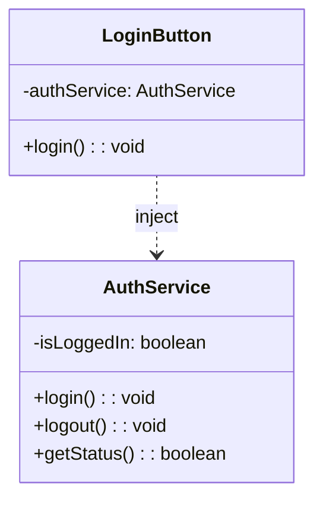

# Servicios en Angular e Inyección de Dependencias

Un **servicio** es una clase que encapsula lógica de negocio o funcionalidad que **no pertenece directamente a un componente**, como:

- Manejo de datos o API REST
- Almacenamiento local
- Autenticación y autorización
- Compartir información entre componentes
- Control de estado de la aplicación

Angular fomenta el uso de servicios para separar las responsabilidades y aplicar el principio **Single Responsibility** del modelo SOLID.

## ¿Qué es la inyección de dependencias (DI)?

La **Inyección de Dependencias (Dependency Injection**) es un patrón de diseño que permite a una clase obtener las instancias que necesita **sin crearlas directamente**, promoviendo:

- Bajo acoplamiento
- Alta cohesión
- Facilidad de prueba
- Reutilización de código

En Angular, la **DI se implementa automáticamente** mediante el sistema de Inyector (`Injector`), que administra la creación, provisión y ciclo de vida de las dependencias.

## Estructura básica de un servicio

```ts title="auth-service.ts" showLineNumbers
import { Injectable } from '@angular/core';

// highlight-next-line
@Injectable({ providedIn: 'root' }) // Se registra automáticamente
export class AuthService {
  private isLoggedIn = false;

  login() {
    this.isLoggedIn = true;
  }

  logout() {
    this.isLoggedIn = false;
  }

  getStatus(): boolean {
    return this.isLoggedIn;
  }
}
```

- `@Injectable()` le indica a Angular que esta clase puede ser inyectada.
- `providedIn: 'root'` significa que el servicio estará disponible en toda la aplicación (Singleton global).

## Inyección en componentes

```ts title="login-button.ts" showLineNumbers
import { Component, inject } from '@angular/core';
import { AuthService } from './auth.service';

@Component({
  selector: 'login-button',
  standalone: true,
  template: `<button (click)="login()">Login</button>`
})
export class LoginButton {
  private authService = inject(AuthService); // Angular 14+

  login() {
    this.authService.login();
  }
}
```

Desde Angular 14+, es posible usar `inject()` en lugar del constructor para inyectar servicios.



## Tipos de proveedores en Angular

|Tipo|Uso|Ejemplo|
|--|--|--|
|`providedIn: 'root'`|Global singleton|Recomendado para la mayoría de casos|
|`providedIn: 'any'`|Instancia por módulo o componente |Útil en lazy loading|
|`providers: []` en `@Component`|Scoped a un componente específico |Aísla estado|

## Ejemplo con productos

```ts title="product-service.ts" showLineNumbers
@Injectable({ providedIn: 'root' })
export class ProductService {
  private products = signal<string[]>([]);

  addProduct(name: string) {
    this.products.update(p => [...p, name]);
  }

  getAll() {
    return this.products;
  }
}
```

```ts title="product-list.ts" showLineNumbers
@Component({
  selector: 'product-list',
  standalone: true,
  template: `<ul><li *ngFor="let p of products()">{{ p }}</li></ul>`
})
export class ProductList {
  private service = inject(ProductService);
  readonly products = this.service.getAll();
}
```

## Relación con la arquitectura

En Clean Architecture o arquitectura modular:

- Servicios representan la **capa de aplicación** o **infraestructura**.
- Se inyectan en controladores, componentes o casos de uso.
- Pueden actuar como **adaptadores** entre componentes y lógica de negocio.

## Buenas prácticas

- Registra servicios con `providedIn: 'root'` por defecto
- Evita lógica de negocio compleja en componentes
- Inyecta con `inject()` en lugar de `constructor()` para servicios sin dependencia circular
- Crea servicios especializados por dominio (SRP)
- Aisla servicios en módulos si tienen responsabilidades locales

## Referencias

- Angular Team. (2024). [Dependency injection in Angular](https://angular.dev/guide/dependency-injection). Angular.dev.
- Angular Team. (2024). [Injectable providers](https://angular.dev/guide/providers). Angular.dev.
- Brown, S. (2023). Clean Angular Architecture. Leanpub.
- Netanel Basal. (2023). [Simplifying Angular DI with inject()](https://netbasal.com).
- Eckles, J. (2023). Mastering Angular Services. Packt Publishing.
