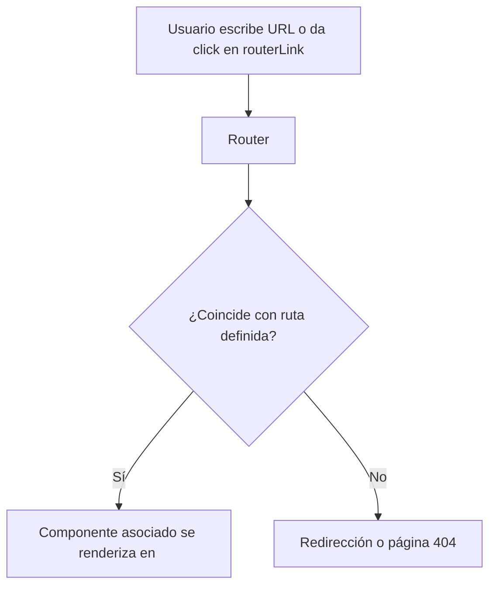

# Routing en Angular (básico y avanzado)

El **enrutamiento (routing)** en Angular es el sistema que permite **navegar entre diferentes vistas o componentes** de una aplicación **Single Page Application (SPA)**, manteniendo la URL sincronizada con el estado de la aplicación.

Angular usa el `Router` para mapear **rutas (URLs)** hacia **componentes específicos**.

Permite:

- Navegación entre páginas
- Rutas anidadas (child routes)
- Parámetros dinámicos
- Lazy loading (carga diferida de módulos/funcionalidades)
- Protección con *guards*
- Animaciones y pre-carga de datos

## Configuración básica

La configuración base se realiza en el archivo `app.routes.ts`:

```ts title="app.routes.ts" showLineNumbers
import { Routes } from '@angular/router';
import { HomePage } from './features/home/home.page';
import { StudentsPage } from './features/students/students.page';

export const APP_ROUTES: Routes = [
  { path: '', component: HomePage },
  { path: 'students', component: StudentsPage },
  { path: '**', redirectTo: '' } // Ruta comodín (404)
];
```

El archivo `app.config.ts` se encarga de proveerla como configuración de la aplicación:

```ts title="app.config.ts" showLineNumbers
import { ApplicationConfig } from '@angular/core';
import { provideRouter } from '@angular/router';
import { APP_ROUTES } from './app.routes';

export const appConfig: ApplicationConfig = {
  providers: [provideRouter(APP_ROUTES)]
};
```

En el componente raíz (`app.ts`) podemos enlazar los links con las rutas de la app:

```ts title="app.ts" showLineNumbers
import { Component } from '@angular/core';
import { RouterOutlet } from '@angular/router';

@Component({
  selector: 'app-root',
  standalone: true,
  imports: [RouterOutlet],
  template: `
    <nav>
      <a routerLink="/">Inicio</a>
      <a routerLink="/students">Estudiantes</a>
    </nav>
    <router-outlet></router-outlet>
  `
})
export class App {}
```

`RouterOutlet` es el contenedor donde Angular renderiza el componente asociado a la ruta activa.



## Navegación básica

1. Enlaces declarativos (`routerLink`):

   ```html
   <a routerLink="/students">Ver Estudiantes</a>
   ```

2. Navegación programática:

   ```ts showLineNumbers
   import { inject } from '@angular/core';
   import { Router } from '@angular/router';

   const router = inject(Router);
   router.navigate(['/students']);
   ```

## Parámetros en rutas

1. Declarar parámetros dinámicos

   ```ts
   { path: 'students/:id', component: StudentDetailPage }
   ```

2. Capturar parámetros en el componente

   ```ts showLineNumbers
   import { Component, inject } from '@angular/core';
   import { ActivatedRoute } from '@angular/router';

   @Component({ standalone: true, template: `<h2>Estudiante: {{ id }}</h2>` })
   export class StudentDetailPage {
     private route = inject(ActivatedRoute);
     id = this.route.snapshot.paramMap.get('id');
   }
   ```

## Rutas hijas (Child routes)

```ts showLineNumbers
{
  path: 'students',
  component: StudentsPage,
  children: [
    { path: ':id', component: StudentDetailPage },
    { path: '', component: StudentListPage }
  ]
}
```

Se renderizan en un `<router-outlet>` interno dentro del componente padre.

## Lazy Loading (carga diferida)

Permite cargar módulos/componentes **solo cuando se necesitan**, optimizando el rendimiento.

```ts showLineNumbers
{
  path: 'courses',
  loadChildren: () =>
    import('./features/courses/courses.routes').then(m => m.COURSE_ROUTES)
}
```

```ts title="courses.routes.ts" showLineNumbers
import { Routes } from '@angular/router';
import { CoursesPage } from './courses.page';

export const COURSE_ROUTES: Routes = [
  { path: '', component: CoursesPage }
];
```

## Guards (protección de rutas)

Los **guards** determinan si se puede acceder a una ruta (autenticación, permisos, datos cargados, etc.).

```ts showLineNumbers
import { inject } from '@angular/core';
import { CanActivateFn, Router } from '@angular/router';
import { AuthService } from '../core/auth.service';

export const authGuard: CanActivateFn = () => {
  const auth = inject(AuthService);
  const router = inject(Router);
  return auth.isLoggedIn() ? true : router.createUrlTree(['/']);
};
```

La manera en que se usa en rutas es:

```ts
{ 
  path: 'dashboard', 
  component: DashboardPage, 
  // highlight-next-line
  canActivate: [authGuard] 
}
```

## Data resolvers (pre-cargar datos)

```ts
import { inject } from '@angular/core';
import { ResolveFn } from '@angular/router';
import { StudentService } from '../core/student.service';

export const studentResolver: ResolveFn<Student[]> = () =>
  inject(StudentService).getAll();
```

En la definición de la ruta se llama:

```ts showLineNumbers
{
  path: 'students',
  component: StudentsPage,
  // highlight-next-line
  resolve: { students: studentResolver }
}
```

## Buenas prácticas

- Usa **lazy loading** para módulos/features pesados.
- Define rutas en archivos separados (`app.routes.ts`, `feature.routes.ts`) para mantener el código limpio.
- Aplica guards para autenticación y autorización.
- Evita lógica compleja en `resolvers`; solo deben cargar datos.
- Usa rutas hijas cuando una sección tenga varias pantallas internas.

## Referencias

- Angular Team. (2024). [Angular Router Guide](https://angular.dev/guide/routing). Angular.dev.
- Angular Team. (2024). [Standalone Routing APIs](https://angular.dev/guide/standalone-components). Angular.dev.
- Brown, S. (2024). Clean Angular Architecture. Leanpub.
- Eckles, J. (2023). Advanced Routing Patterns in Angular. Packt Publishing.
