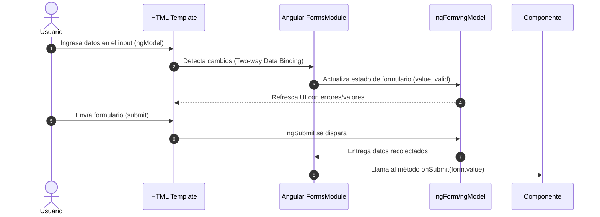
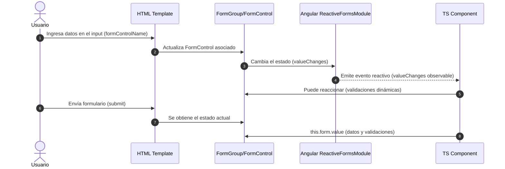
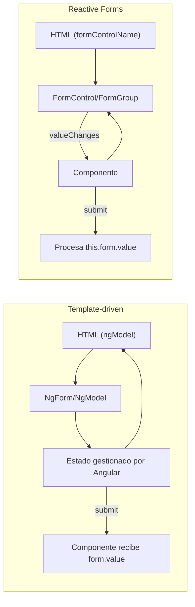

# Formularios reactivos vs. template-driven

Angular proporciona dos enfoques principales para manejar formularios:

1. **Template-driven (basados en plantillas)**: la lógica del formulario se define principalmente en el HTML usando directivas de Angular (`ngModel`, `ngForm`, etc.).
2. **Reactive Forms (reactivos)**: la lógica del formulario se define en TypeScript mediante clases y estructuras reactivas (`FormGroup`, `FormControl`, `FormBuilder`).

Ambos enfoques usan el mismo **módulo de formularios** de Angular y se pueden combinar, aunque se recomienda elegir uno de ellos por consistencia.

## Formularios Template-driven

- Declarativos: el **HTML es el que define el formulario** y su comportamiento.
- Usa directivas como `ngModel` y `ngForm`.
- Angular crea los objetos de formulario de **forma implícita**.
- Ideal para formularios simples.

```html showLineNumbers
<form #loginForm="ngForm" (ngSubmit)="onSubmit(loginForm)">
  <input type="text" name="username" ngModel required />
  <input type="password" name="password" ngModel required />
  <button type="submit">Login</button>
</form>
```

```ts showLineNumbers
onSubmit(form: any) {
  console.log(form.value); // { username: '', password: '' }
}
```

Cómo ventajas tenemos:

- Sintaxis simple y declarativa.
- Fácil de usar para formularios pequeños.
- Menor cantidad de código TypeScript.

Por otro lado, las desventajas son:

- Difícil de escalar en formularios complejos.
- Menor control sobre el estado y validaciones.
- Testing menos directo.



1. El usuario interactúa con el HTML (input con `[(ngModel)]`).
2. Angular detecta cambios con su sistema de data binding bidireccional.
3. NgForm y ngModel mantienen el estado del formulario (valores, validaciones, touched, pristine, etc.).
4. Angular actualiza la vista automáticamente si hay errores o cambios.
5. El usuario envía el formulario.
6. Al enviar el formulario, el evento ngSubmit se dispara.
7. El modelo reúne recolecta todos los datos.
8. Se llama el método `onSubmit()` con los datos recolectados.

La lógica del formulario se encuentra principalmente en el template, y Angular gestiona automáticamente el estado.

## Formularios Reactivos

- Imperativos: el **formulario se define y controla en el TypeScript**.
- Usa APIs de `FormControl`, `FormGroup`, `FormArray` y `FormBuilder`.
- Más expresivos y escalables.
- Ideal para **formularios grandes o dinámicos**.

```ts title="login-page.ts" showLineNumbers
import { Component } from '@angular/core';
import { FormBuilder, Validators } from '@angular/forms';

@Component({
  selector: 'login-page',
  standalone: true,
  imports: [],
  templateUrl: './login-page.html'
})
export class LoginPage {
  loginForm = this.fb.group({
    username: ['', Validators.required],
    password: ['', Validators.required]
  });

  constructor(private fb: FormBuilder) {}

  onSubmit() {
    console.log(this.loginForm.value);
  }
}
```

```html
<form [formGroup]="loginForm" (ngSubmit)="onSubmit()">
  <input type="text" formControlName="username" />
  <input type="password" formControlName="password" />
  <button type="submit">Login</button>
</form>
```

Estos formularios tienen cómo ventajas:

- Control total sobre el estado y validaciones.
- Más fácil de testear.
- Soporta lógica de negocio compleja y formularios dinámicos.
- Integración fluida con **Reactive programming** (RxJS).

Pero,

- Sintaxis algo más extensa.
- Más código en TypeScript.



1. El usuario interactúa con un input asociado a un `FormControl` vía `formControlName`.
2. Angular actualiza el `FormControl` inmediatamente (unidireccionalmente).
3. El `FormGroup` y sus `FormControls` emiten eventos por `valueChanges`.
4. Se emite un evento reactivo que actualiza las validaciones.
5. El componente puede reaccionar a los cambios en tiempo real usando observables.
6. El usuario envía el formulario.
7. Al hacer submit, el template obtiene el estado actual y lo envía al `FormGroup`.
8. El componente obtiene el valor del formulario (this.form.value) y su estado (valid, dirty, etc.).

La lógica del formulario está en el componente TypeScript, y Angular ofrece control total y reactividad.

## Comparativa rápida

|Característica|Template-driven|Reactive Forms|
|--|--|--|
|Declaración|Principalmente en HTML|Principalmente en TypeScript|
|Complejidad|Formularios simples|Formularios grandes/dinámicos|
|Validaciones|Directivas en plantilla (`required`)|Clases de validación (`Validators`)|
|Testing|Menos directo|Más sencillo|
|Reactividad|Limitada|Completa (integrado con RxJS)|
|Control del estado|Angular lo maneja implícitamente|Control total del desarrollador|



## Buenas prácticas

1. Usa **Reactive Forms** si tu aplicación:
   - Tiene formularios complejos
   - Requiere validaciones avanzadas
   - Necesita dinámicamente añadir/quitar campos
   - Va a ser muy testeada
2. Usa **Template-driven** si:
   - Tu formulario es pequeño y simple
   - Quieres escribir la mínima cantidad de TypeScript
   - El formulario no necesita lógica avanzada

## Referencias

- Angular Team. (2024). [Reactive forms vs template-driven forms.](https://angular.dev/guide/forms) Angular.dev.
- Eckles, J. (2023). Advanced Angular Forms. Packt Publishing.
- Brown, S. (2024). Clean Angular Architecture. Leanpub.
- Netanel Basal. (2023). [Best practices with Angular Reactive Forms.](https://netbasal.com)
