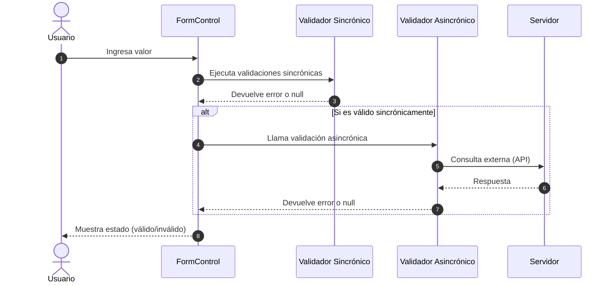

# Validación de formularios (sincrónica y asincrónica)

La **validación de formularios** es el proceso mediante el cual se verifica que los datos ingresados por el usuario **cumplen con ciertas reglas** antes de procesarlos.

En Angular, las validaciones se pueden aplicar de forma:

- **Sincrónica:** Validaciones inmediatas que no requieren operaciones externas.
- **Asincrónica:** Validaciones que dependen de operaciones externas (consultas a API, bases de datos, etc.).

## Validación sincrónica

- Se ejecuta de forma inmediata al cambiar el valor del campo.
- Ideal para reglas de formato, longitud, obligatoriedad, etc.
- No depende de servicios externos.

### Template-driven Forms (sincrónica)

```html showLineNumbers
<form #form="ngForm">
  <input name="email" ngModel required email />
  <div *ngIf="form.controls['email']?.invalid && form.controls['email']?.touched">
    El email es obligatorio y debe tener formato válido
  </div>
</form>
```

Angular provee validadores integrados como `required`, `email`, `minlength`, etc.

### Reactive Forms (sincrónica)

```ts showLineNumbers
import { FormBuilder, Validators } from '@angular/forms';

this.loginForm = this.fb.group({
  username: ['', [Validators.required, Validators.minLength(3)]],
  password: ['', Validators.required]
});
```

```html showLineNumbers
<input formControlName="username" />
<div *ngIf="loginForm.get('username')?.hasError('required')">
  El usuario es obligatorio
</div>
<div *ngIf="loginForm.get('username')?.hasError('minlength')">
  Debe tener al menos 3 caracteres
</div>
```

### Validadores personalizados (sincrónicos)

```ts showLineNumbers
import { AbstractControl, ValidationErrors } from '@angular/forms';

export function noAdminValidator(control: AbstractControl): ValidationErrors | null {
  return control.value === 'admin' ? { noAdmin: true } : null;
}
```

```ts showLineNumbers
this.form = this.fb.group({
  username: ['', [Validators.required, noAdminValidator]]
});
```

## Validación asincrónica

- Ejecuta la validación **después** de las validaciones sincrónicas.
- Depende de operaciones externas (consultas a un API, base de datos, etc.).
- Devuelve un **Observable** o **Promise** que resuelve `null` si es válido o un objeto de error si es inválido.

### Reactive Forms (asincrónica)

```ts showLineNumbers
import { of } from 'rxjs';
import { map, delay } from 'rxjs/operators';
import { AbstractControl, AsyncValidatorFn } from '@angular/forms';

function usernameExistsValidator(): AsyncValidatorFn {
  return (control: AbstractControl) => {
    // Simula consulta al servidor
    const usuariosExistentes = ['carlos', 'david'];
    return of(usuariosExistentes.includes(control.value)).pipe(
      delay(1000),
      map(existe => (existe ? { userExists: true } : null))
    );
  };
}

this.form = this.fb.group({
  username: ['', Validators.required, usernameExistsValidator()]
});
```

```html showLineNumbers
<input formControlName="username" />
<div *ngIf="form.get('username')?.hasError('userExists')">
  Este usuario ya existe
</div>
```

### Template-driven Forms (asincrónica)

Para este tipo de formularios, es necesario implementar una directiva que actúe como validador asincrónico:

```ts showLineNumbers
import { Directive } from '@angular/core';
import { NG_ASYNC_VALIDATORS, AbstractControl } from '@angular/forms';
import { of } from 'rxjs';
import { delay, map } from 'rxjs/operators';

@Directive({
  selector: '[userExists]',
  providers: [{ provide: NG_ASYNC_VALIDATORS, useExisting: UserExistsDirective, multi: true }]
})
export class UserExistsDirective {
  validate(control: AbstractControl) {
    const usuariosExistentes = ['carlos', 'ana'];
    return of(usuariosExistentes.includes(control.value)).pipe(
      delay(1000),
      map(existe => (existe ? { userExists: true } : null))
    );
  }
}
```

```html
<input name="username" ngModel required userExists />
<div *ngIf="form.controls['username']?.hasError('userExists')">
  Este usuario ya existe
</div>
```

## Uso de validaciones sincrónicas y asincrónicas



Angular procesa las validaciones de un campo (FormControl) en dos fases:

- Validación sincrónica: Reglas inmediatas (ej. required, minLength).
- Validación asincrónica: Reglas que requieren comunicación con servicios externos (ej. verificar que un usuario no exista en el servidor).

1. El usuario ingresa un valor en el formulario.
2. El `FormControl` detecta el cambio y ejecuta las validaciones sincrónicas.
3. El validador sincrónico analiza el valor ingresado y retorna un error o null según el caso.
4. En caso de que se halla validado sincrónicamente, el `FormControl` llama a las validaciones asincrónicas.
5. El validador realiza una consulta externa (API) para verificar la condición.
6. El servidor entrega una respuesta a la consulta hecha.
7. El validador asincrónico recibe la respuesta y según la misma, retorna un error o un null.
8. El `FormControl` procesa la respuesta del validador asincrónico y actualiza su estado (válido o inválido)

## Buenas prácticas

- Usa **validaciones sincrónicas** para **reglas simples y comunes** (obligatoriedad, formato, longitud).
- Usa **validaciones asincrónicas** solo **cuando sea necesario** (por ejemplo, verificar datos en servidor).
- Evita validaciones asincrónicas en cada tecla: aplica `debounceTime()` en observables o validaciones bajo demanda.
- Mantén los validadores personalizados reutilizables y testables.
- Combina validaciones en grupos (`FormGroup`) si dependen de múltiples campos.

## Referencias

- Angular Team. (2024). [Form validation guide.](https://angular.dev/guide/forms) Angular.dev.
- Netanel Basal. (2023). [Async Validators in Angular Forms.](https://netbasal.com)
- Brown, S. (2024). Clean Angular Architecture. Leanpub.
- Eckles, J. (2023). Advanced Angular Forms and Validations. Packt Publishing.
