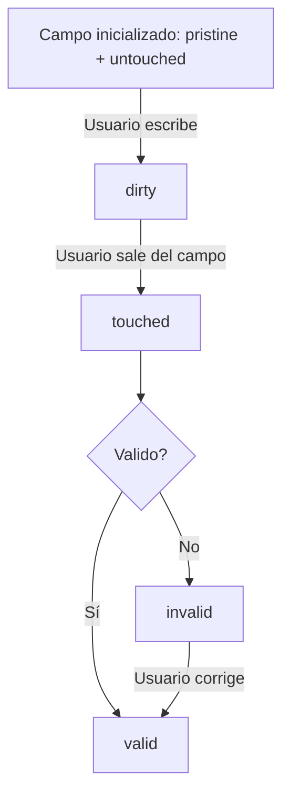
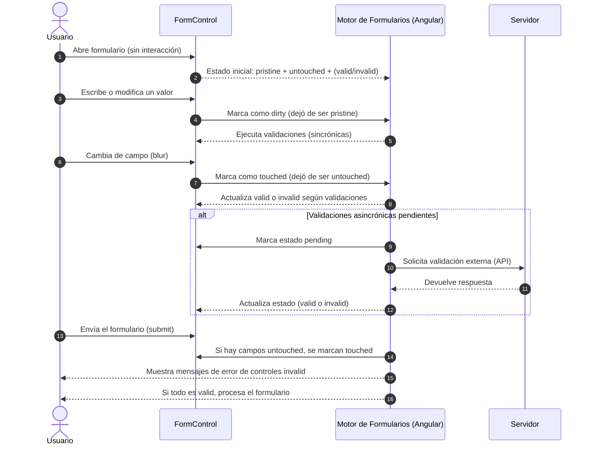

# Manejo de estados en formularios

En Angular, los **formularios (y cada uno de sus controles)** tienen propiedades que describen su **estado actual**. Esto permite saber si un formulario es válido, si ha sido modificado o si el usuario ha interactuado con él.

Principales estados de un FormControl:

1. Validación:
   - `valid`: El control o formulario **cumple con todas las validaciones**.
   - `invalid`: Alguna validación falla.
2. Interacción:
   - `touched`: El usuario ha **entrado y salido** del campo (blur).
   - `untouched`: El usuario **aún no ha interactuado** con el campo.
   - `dirty`: El usuario **ha modificado el valor** del control.
   - `pristine`: El valor **no ha cambiado** desde su inicialización.
3. Disponibilidad:
   - `enabled`: El control **está disponible** para la interacción del usuario.
   - `disabled`: El control **no está disponible** para la interacción del usuario.
4. Pendiente de validación asincrónica:
   - `pending`: Indica que hay **validaciones asincrónicas** en curso.

## Estados en Template-Driven Forms

Angular expone estas propiedades a través de las directivas `ngForm`, `ngModel` y `ngModelGroup`.

```html showLineNumbers
<form #f="ngForm">
  <input name="email" ngModel required #email="ngModel" />

  <div *ngIf="email.invalid && email.touched">
    El email es obligatorio
  </div>

  <p>Estado: {{ email.dirty ? 'Modificado' : 'Sin cambios' }}</p>
</form>
```

Propiedades disponibles en `ngModel` o `ngForm`:

- `valid`, `invalid`
- `touched`, `untouched`
- `dirty`, `pristine`
- `pending`

## Estados en Reactive Forms

En Reactive Forms, cada `FormControl`, `FormGroup` y `FormArray` expone los mismos estados:

```ts showLineNumbers
this.form = this.fb.group({
  email: ['', Validators.required]
});
```

```html showLineNumbers
<form [formGroup]="form">
  <input formControlName="email" />
  <div *ngIf="form.get('email')?.invalid && form.get('email')?.touched">
    El email es obligatorio
  </div>
</form>
```

El acceso en TypeScript a los estados de cada control es mediante `get()`:

```ts showLineNumbers
const emailControl = this.form.get('email');
console.log(emailControl?.valid);     // true o false
console.log(emailControl?.dirty);     // true o false
console.log(emailControl?.touched);   // true o false
```

## Cambiar estados manualmente

Angular permite forzar el cambio de estado:

```ts
const control = this.form.get('email');

// Marca el control como tocado
control?.markAsTouched();

// Marca el control como modificado
control?.markAsDirty();

// Marca el control como intacto
control?.markAsPristine();
```

Esto es útil para mostrar mensajes de validación **sin necesidad de que el usuario interactúe primero**.

## Estados a nivel de formulario `FormGroup`

Un `FormGroup` es **válido solo si todos sus hijos son válidos**. Sus propiedades (`valid`, `dirty`, etc.) dependen de los controles que contiene.

```ts
console.log(this.form.valid);      // true si todos los controles son válidos
console.log(this.form.touched);    // true si alguno fue tocado
```

## Flujo de ciclo de estados



## Secuencia de estados



1. El usuario ingresa al componente y abre el formulario
2. Mientras el usuario no tenga ninguna interacción con el formulario, el estado inicial es pristine + untouched + (valid/invalid) (este último depende del estado inicial que se le programa).
3. El usuario interactúa con el formulario, escribiendo o modificando un valor.
4. El `FormControl` actualiza su estado a `dirty`, dado que sus valores iniciales ya no son iguales al actual.
5. El motor de formularios de Angular ejecuta las validaciones (sincrónicas) y actualiza el estado del `FormControl`.
6. Cuando el usuario cambia de campo (blur), es decir, cuando el cursor sale del campo.
7. El `FormControl` actualiza su estado a `touched`, dado que ya ha sido interactuado.
8. Según las validaciones del motor de Angular, se actualiza el estado del `FormControl` a `valid` o `invalid`.
9. Si hay validaciones asíncronas se empieza una secuencia interna. Mientras estén activas las validaciones asíncronas, el estado del `FormControl` es `pending`.
10. Se solicita la validación externa (API) y se espera a que se devuelva la respuesta.
11. Cuando el servidor devuelve la respuesta, el motor de formularios responde hacia el FormControl.
12. El estado del FormControl se actualiza a `valid` o `invalid` según la respuesta del servidor.
13. En usuario decide enviar el formulario (submit).
14. Si hay campos que no han sido interactuados (`untouched`), se marcan como `touched`.
15. En caso de que hayan errores, se muestran los mensajes de error de los controles `invalid`.
16. Si todo es valido, entonces, el formulario se procesa y el usuario puede ver el resultado de la operación.

## Buenas prácticas

- Usa **touched** para mostrar mensajes de error **solo cuando el usuario abandona el campo**.
- Usa **dirty** para detectar si el usuario ha modificado el formulario.
- Usa **pending** para mostrar indicadores de carga en validaciones asincrónicas.
- Para enviar formularios, comprueba siempre el estado **valid** del `FormGroup`.

## Resumen de los estados

|Estado|¿Qué indica?|
|--|--|
|`pristine`|El valor no ha cambiado desde su creación|
|`dirty`|El valor ha sido modificado|
|`untouched`|El usuario no ha interactuado con el campo|
|`touched`|El usuario ha entrado y salido del campo|
|`valid`|Pasa todas las validaciones|
|`invalid`|Falla al menos una validación|
|`pending`|Hay validaciones asincrónicas en curso|

## Referencias

- Angular Team. (2024). [Form control state and status](https://angular.dev/guide/forms). Angular.dev.
- Netanel Basal. (2023). [Angular Form States Explained](https://netbasal.com).
- Brown, S. (2024). Clean Angular Architecture. Leanpub.
