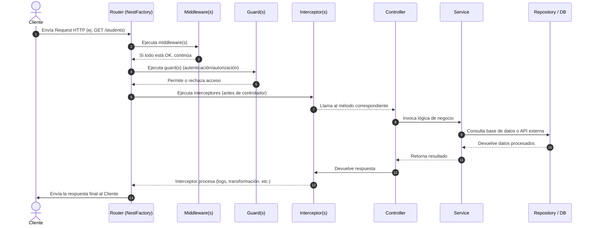

# ¿Qué es NestJS y cómo se estructura?

NestJS es un **framework progresivo de Node.js** que permite desarrollar **aplicaciones del lado del servidor (backend)** con **arquitectura modular, tipado fuerte (TypeScript) y principios de diseño escalables.**

## Principales características

- **Basado en TypeScript** (aunque soporta JavaScript).
- Se inspira en la arquitectura de **Angular**: módulos, controladores, servicios, inyección de dependencias.
- Compatible con **HTTP (REST), GraphQL, WebSockets, gRPC, CLI** y más.
- Utiliza **Express.js** por defecto, pero permite cambiar el adaptador a **Fastify** para mayor rendimiento.
- Favorece **Clean Architecture** y principios **SOLID**.

## Filosofía y objetivos

NestJS se creó para **resolver los problemas de arquitectura** en proyectos de Node.js:

- Evitar el “código spaghetti”.
- Tener **modularidad**, **capas bien definidas** y **testabilidad**.
- Integrar herramientas modernas: **Pipes**, **Guards**, **Interceptores** y **Decoradores**.

En pocas palabras: NestJS es al backend lo que Angular es al frontend. Usa patrones conocidos (módulos, inyección de dependencias) para que las aplicaciones sean escalables y mantenibles.

## Estructura básica de un proyecto NestJS 11.x

Un proyecto NestJS utiliza una arquitectura modular. La estructura inicial típica es:

```txt
src/
├── app.module.ts
├── app.controller.ts
├── app.service.ts
├── main.ts
├── modules/
│   ├── students/
│   │   ├── students.module.ts
│   │   ├── students.controller.ts
│   │   ├── students.service.ts
│   │   └── dto/
│   │       ├── create-student.dto.ts
│   │       └── update-student.dto.ts
│   └── courses/
│       ├── courses.module.ts
│       ├── courses.controller.ts
│       └── courses.service.ts
└── shared/
    ├── guards/
    ├── interceptors/
    ├── filters/
    └── utils/
```

## Componentes principales

- `main.ts`

  Archivo de **bootstrap**: arranca la aplicación y configura opciones globales.

  ```ts
  import { NestFactory } from '@nestjs/core';
  import { AppModule } from './app.module';
  import { ValidationPipe } from '@nestjs/common';

  async function bootstrap() {
    const app = await NestFactory.create(AppModule, { snapshot: true });
    app.useGlobalPipes(new ValidationPipe({ whitelist: true, transform: true }));
    await app.listen(3000);
  }
  bootstrap();
  ```

- `AppModule` (Módulos)
  
  Agrupa componentes relacionados (controladores, servicios y dependencias). Puedes tener varios módulos y conectarlos entre sí.

  ```ts
  import { Module } from '@nestjs/common';
  import { StudentsModule } from './modules/students/students.module';

  @Module({
    imports: [StudentsModule], // carga el módulo de estudiantes
  })
  export class AppModule {}
  ```

- `Controller` (Controladores)
  
  Definen rutas HTTP y cómo responder a las solicitudes. Usan decoradores como `@Get()`, `@Post()`.

  ```ts
  import { Controller, Get } from '@nestjs/common';
  import { StudentsService } from './students.service';

  @Controller('students')
  export class StudentsController {
    constructor(private service: StudentsService) {}

    @Get()
    findAll() {
      return this.service.findAll();
    }
  }
  ```

- `Service` (Servicios)

  Contienen la lógica de negocio y se inyectan en los controladores. Se declaran con `@Injectable()`.

  ```ts
  import { Injectable } from '@nestjs/common';

  @Injectable()
  export class StudentsService {
    private students = ['Ana', 'Carlos', 'Juan'];

    findAll() {
      return this.students;
    }
  }
  ```

- `DTOs` y `Validaciones`
  
  Los **DTO (Data Transfer Objects)** definen la estructura de datos esperada.Se validan con `class-validator` y `class-transformer`.

  ```ts
  import { IsString, IsNotEmpty } from 'class-validator';

  export class CreateStudentDto {
    @IsString()
    @IsNotEmpty()
    name: string;
  }
  ```

- Otros componentes importantes:
  
  - **Pipes:** Transforman o validan datos antes de llegar al controlador.
  - **Guards:** Controlan el acceso (autenticación, roles).
  - **Interceptors:** Modifican la respuesta o añaden lógica transversal (logs, caché).
  - **Filters:** Manejan excepciones personalizadas.

## Flujo de petición en NestJS



1. El cliente (navegador, Postman, frontend) envía una petición HTTP, lo que conocemos como **Request**. Por su parte, el **Router** de NestJS determina qué controlador debe manejar la ruta.
2. En el **Middleware** se ejecutan funciones intermedias (logging, parsers, CORS, etc.).
3. Si todo está bien, el Middleware le da paso a la petición.
4. La petición activa los **Guards**, en donde se verifica autenticación o permisos antes de acceder al controlador.
5. El guardia permite o rechaza el acceso, dependiendo de la configuración.
6. La petición pasa a los **Interceptors** (fase previa), que pueden realizar acciones antes de que el controlador procese la request. En este se pueden modificar los datos de entrada, y registrar métricas o logs.
7. El interceptor llama al método correspondiente.
8. El **Controller** invoca la lógica de negocio, el método correspondiente (ej. `@Get()`) recibe la petición. Invoca los servicios necesarios para procesar la lógica de negocio.
9. El **Service** contiene la lógica de negocio central. Si es necesario, consulta a un repositorio o base de datos.
10. El **Repository** accede a la base de datos o a APIs externas, y devuelve datos al servicio.
11. El servicio toma el resultado y lo devuelve al controlador.
12. El controlador devuelve la respuesta al interceptor.
13. Los **Interceptors (fase posterior)** modifican la respuesta antes de enviarla al cliente.
14. La **Response** es el resultado final que NestJS devuelve al cliente.

## Ventajas de usar NestJS

- **Escalable y modular:** perfecto para monolitos y microservicios.
- **Tipado con TypeScript:** ayuda a prevenir errores.
- **Testabilidad:** arquitectura orientada a pruebas.
- **Foros:** Comunidad activa y soporte de librerías.
- **Compatibilidad:** se integra con ORMs como Prisma, TypeORM o Sequelize.

## Referencias (APA 7)

- Kamil Myśliwiec. (2024). [NestJS Documentation (v11)](https://docs.nestjs.com).
- Brown, S. (2023). Clean Architecture with NestJS. Leanpub.
- Eckles, J. (2024). Backend Scalable Applications with Node & NestJS. Packt Publishing.
